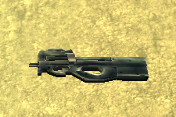
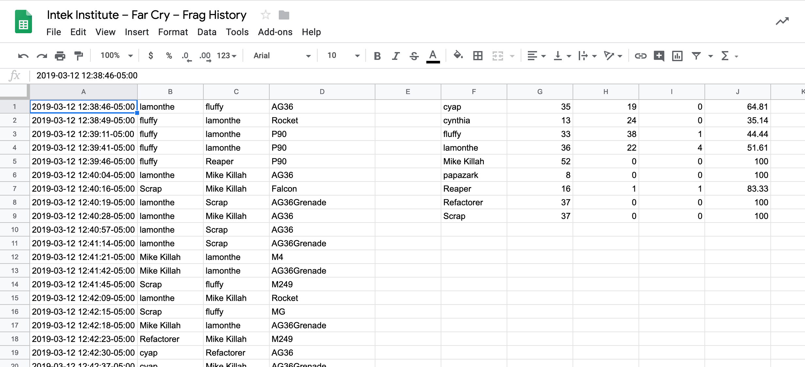

# Far Cry


## Introduction

[Far Cry is a first-person shooter (FPS) video game](https://www.youtube.com/watch?v=Cz3vGM08S7Q&has_verified=1) with amazing graphics, developed by Crytek and published by Ubisoft. The game was released in 2004 for Microsoft Windows and was a huge commercial success. Ubisoft closed the online servers almost 12 years later.

Far Cry features several [multiplayer modes](https://www.youtube.com/watch?v=GaFM0uWAzh0) in which players basically score points by killing other players. One of these multiplayer modes is deathmatch, also known as free for all (FFA), where the goal is to kill (or frag, from the military term) as many other players as possible within a limited period of time. Basically, everything that moves SHOULD be killed… :)

## Multiplayer FFA Session

Players can join an online multiplayer session by connecting to a Far Cry server. A session starts for a configurable limited period of time, for example: 30 minutes, during which each player tries their best to seek out and kill other players.

When the limited period of time expires, the game stops and it displays the results of the match as an ordered leaderboard with the number of kills and deaths per player, and the efficiency of each player:


## Weapons

Players have access to a large arsenal of real-world weapons in Far Cry, from grenades and pistols, to rocket launchers, machines guns and sniper rifles. Check out [all of the weapons from good old Far Cry](https://www.youtube.com/watch?v=vzNG4VlCTFM)! They sound so cool!

| Name                                              | Code                                                  | Photo                                              |
| ------------------------------------------------- | ----------------------------------------------------- | -------------------------------------------------- |
| Machete                                           | `Machete`                                             |                      |
| Jungle Falcon                                     | `Falcon`                                              |                |
| Jackhammer Shotgun                                | `Shotgun`                                             |           |
| P90 SMG                                           | `P90`                                                 |                      |
| MP5 SMG                                           | `MP5`                                                 |                      |
| M4 Carbine                                        | `M4`                                                  |                   |
| AG36 Assault Rifle                                | `AG36` for the rifle, `AG36Grenade` for the explosive |           |
| OICW Advanced Assault Rifle                       | `OICW` for the rifle, `OICWGrenade` for the explosive |  |
| AW50 Sniper Rifle                                 | `SniperRifle`                                         |            |
| M249 SAW MG                                       | `M249`                                                |                  |
| Rocket Launcher                                   | `Rocket`                                              |              |
| Grenade                                           | `HandGrenade`                                         |                  |
| Mk.19 Mounted Mortar Launcher Platform            | `StickyExplosive`                                     |                       |
| Patrol Boat (when a player runs over another)     | `Boat`                                                |                 |
| Humvee or Buggy (when a player runs over another) | `Vehicle`                                             |                       |
| Rocket Launcher mounted on a vehicle              | `VehicleMountedRocketMG`                              |                      |
| Mounted Minigun                                   | `VehicleMountedAutoMG`, `MG`                          |               |
| Machine Gun mounted on a vehicle                  | `VehicleMountedMG`                                    |                       |
| Rocket Launcher mounted on a vehicle              | `VehicleRocket`                                       |                      |

_Note: AG36 Assault Rifle and OICW Advanced Assault Rifle weapons have two fire modes: automatic rifle and grenade launcher._

## Server Log: Frag History

The Far Cry server stores [log information in a text file](./logs/log00.txt), starting with engine and system initialization data, followed by all the frags that occurred in every match sessions. For instance:

```bash
$ cat ./logs/log00.txt | grep killed | head
<26:32> <Lua> papazark killed lamonthe with AG36
<27:07> <Lua> theprophete killed lamonthe with Rocket
<27:18> <Lua> theprophete killed lamonthe with Rocket
<27:29> <Lua> theprophete killed lamonthe with Rocket
<27:47> <Lua> theprophete killed lamonthe with Rocket
<28:10> <Lua> theprophete killed papazark with Rocket
<28:49> <Lua> theprophete killed papazark with Rocket
<29:28> <Lua> papazark killed lamonthe with AG36
<29:36> <Lua> papazark killed lamonthe with AG36
<30:07> <Lua> theprophete killed papazark with SniperRifle
```

The format of a line corresponding to a frag, when a player kills one other player, is:

```text
<MM:SS:> <Lua> killer_username killed victim_username with weapon_code
```

or the following format, when a player kills himself, e.g., when a stupid player miserably dies by throwing a grenade that eventually explodes at their feet...

```text
<MM:SS:> <Lua> killer_username killed itself
```

Where:

- `MM`: zero-padded minute between 00 and 59 of the time when the frag occurred;
- `SS`: zero-padded second between 00 and 59 of the time when the frag occurred;
- `killer_username`: username of the player who fragged another; can only contain letters, numbers, dashes ("`-`"), periods ("`.`"), and underscores (`_`);
- `victim_username`: username of the player who has been fragged;
- `weapon_code`: code name of the weapon that was used to frag the other player.

_Note: The time of a frag is relative to the time the Far Cry engine started. It represents the number of minutes/seconds elapsed between the moment the game engine started and when the frags occurred._

_Note: Players who joined a match but who hid during all the match, meaning they didn't kill anyone and they haven't been killed by anyone, don't appear in the frag history at all. We just ignore them._

You can download [Far Cry 1.34 on Windows](https://drive.google.com/file/d/1pQ5RFuQ3t669KXd_jV-2KoOONdT6NcY8/view?usp=sharing), [unzip](https://www.7-zip.org/) the archive on the disk of your computer, and run the executable `./Bin32/FarCry.exe`.


# Waypoint 1: Read Game Session Log File

Write a function `read_log_file` that takes an argument `log_file_pathname`, representing the pathname of a Far Cry server log file, and reads and returns all the bytes from the file.

For example:

```python
>>> log_data = read_log_file('./logs/log00.txt')
>>> len(log_data)
45633
```

# Waypoint 2: Parse Far Cry Engine's Start Time

The time of each frag is related to the date and time the Far Cry engine started. The latter is provided in the first line of the Far Cry log file:

```bash
$ head -1 ./logs/log00.txt
Log Started at Friday, November 09, 2018 12:22:07
```

We need to parse this date and time information to later determine the [timestamp](https://en.wikipedia.org/wiki/Timestamp) of each frag.

Write a function `parse_log_start_time` that takes an argument `log_data`, representing the data read from a Far Cry server's log file, and returns a [`datetime.datetime`](https://docs.python.org/3/library/datetime.html#datetime.datetime) object representing the time the Far Cry engine began to log events.

```python
>>> log_data = read_log_file('./logs/log00.txt')
>>> log_start_time = parse_log_start_time(log_data)
>>> log_start_time
datetime.datetime(2018, 11, 9, 12, 22, 7)
>>> log_start_time.isoformat()
'2018-11-09T12:22:07'
```

_Note 1: You can easily parse a human-readable date time such as `Saturday, March 30, 2019 09:11:31` into a `datetime.datetime` object with the function [`strptime`](https://docs.python.org/3/library/datetime.html#datetime.datetime.strptime) and the various [format strings](https://docs.python.org/3/library/datetime.html#strftime-strptime-behavior) this function supports._

_Note 2: The method [`isoformat`](https://docs.python.org/3/library/datetime.html#datetime.datetime.isoformat) returns a string representation of the date and time in the international date standard [ISO 8601](https://www.iso.org/iso-8601-date-and-time-format.html) format._

# Waypoint 3: Parse Far Cry Engine's Start Time with Time Zone


However, even the time `November 09, 2018 12:22:07` is a relative time. It is relative to the place (a location) on Earth where the related event occurred. We call this time a [local time](https://www.dictionary.com/browse/local-time).

If we had to store statistics of Far Cry match sessions that started from all over the world, we would not be able to chronologically sort them. The time expression `Saturday, March 30, 2019 09:11:31` doesn't represent the same point of time for two locations far away from each other, such as Bordeaux and Saigon.

We generally define a [time with its corresponding time zone](https://en.wikipedia.org/wiki/ISO_8601#Time_zone_designators) related to [UTC](https://en.wikipedia.org/wiki/Coordinated_Universal_Time), also known as [UTC offset](https://en.wikipedia.org/wiki/UTC_offset).

We need to retrieve the [time zone](https://en.wikipedia.org/wiki/Time_zone) of the location where a match session took place. This information is given in the Far Cry log file as a [_console variable_](https://docs.cryengine.com/pages/viewpage.action?pageId=25535264) (`cvar`) named `g_timezone`:

```bash
$ grep g_timezone ./logs/log00.txt
<18:12> Lua cvar: (g_timezone,-5)
```

_Note: You might want to parse and load all the console variables declared in the Far Cry log file into a [dictionary](https://docs.python.org/3.7/tutorial/datastructures.html#dictionaries) object. It would be easier to manipulate these settings later._

```bash
$ grep cvar ./logs/log00.txt | head -n 20
<22:08> Lua cvar: (ca_ambient_light_intensity,0.2000000029802322)
<22:08> Lua cvar: (ca_ambient_light_range,10)
<22:08> Lua cvar: (ca_EnableDecals,0)
<22:08> Lua cvar: (cl_installshieldversion,44)
<22:08> Lua cvar: (cl_lazy_weapon,0)
<22:08> Lua cvar: (cl_projectile_light,1)
<22:08> Lua cvar: (cl_punkbuster,0)
<22:08> Lua cvar: (cl_saveubipassword,0)
<22:08> Lua cvar: (cl_weapon_fx,2)
<22:08> Lua cvar: (cl_weapon_light,1)
<22:08> Lua cvar: (d3d9_TextureFilter,BILINEAR)
<22:08> Lua cvar: (e_active_shadow_maps_receving,0)
<22:08> Lua cvar: (e_beach,1)
<22:08> Lua cvar: (e_brushes_merging,1)
<22:08> Lua cvar: (e_cgf_load_lods,1)
<22:08> Lua cvar: (e_decals,0)
<22:08> Lua cvar: (e_decals_life_time_scale,0.500000)
<22:08> Lua cvar: (e_detail_texture_quality,1)
<22:08> Lua cvar: (e_flocks,0)
<22:08> Lua cvar: (e_light_maps_quality,2)
```

Update your function `parse_log_start_time` to return a [`datetime.datetime`](https://docs.python.org/3/library/datetime.html#datetime.datetime) object with time zone information.

```python
>>> log_data = read_log_file('./logs/log00.txt')
>>> log_start_time = parse_log_start_time(log_data)
>>> log_start_time
datetime.datetime(2018, 11, 9, 12, 22, 7, tzinfo=datetime.timezone(datetime.timedelta(days=-1, seconds=68400)))
>>> log_start_time.isoformat()
'2018-11-09T12:22:07-05:00'
```

# Waypoint 4: Parse Match Session's Mode and Map

As mentioned previously, Far Cry features several multiplayer modes:

- `ASSAULT`: There are two teams, one is defending a flag and the other team is attacking it. Each maps has 3 flags and if after 20 minutes not all flags are captured the teams switch sides. The flags are on fixed positions in the map and only one flag at a time is active;
- `TDM` (Team DeathMatch): There are two teams. Players of one team kill members of the other team;
- `FFA` (Free-For-All): Players kill anyone they can find.

There are also several maps available such as `mp_surf`, `mp_radio` and `mp_jungle` to name a few.

When you start a multiplayer session, you select which mode and which map to play with. The Far Cry engine saves this information in its log file:

```bash
$ grep "Loading level" ./logs/log00.txt
<25:01> ---------------------- Loading level Levels/mp_surf, mission FFA ----------------------------------
```

Write a function `parse_session_mode_and_map` that takes an argument `log_data`, representing the data read from a Far Cry server's log file, and returns a tuple `(mode, map)` where:

- `mode`: indicates the multiplayer mode that was played, either `ASSAULT`, `TDM`, or `FFA`;
- `map`: the name of the map that was used, for instance `mp_surf`.

```python
>>> log_data = read_log_file('./logs/log00.txt')
>>> parse_match_mode_and_map(log_data)
('FFA', 'mp_surf')
```

# Waypoint 5: Parse Frag History

You need to write a Python function `parse_frags` that takes an argument `log_data`, representing the data read from a Far Cry server's log file, and returns a list of frags.

Each frag is represented by a tuple in the following form:

```text
(frag_time, killer_name, victim_name, weapon_code)
```

or, a simpler form, if the player committed suicide:

```text
(frag_time, killer_name)
```

where:

- `frag_time` (required): time when the frag occurred in the format `MM:SS`;
- `killer_name` (required): username of the player who fragged another or killed himself;
- `victim_name` (optional): username of the player who has been fragged;
- `weapon_code` (optional): code name of the weapon that was used to frag.

The parameter `log_file_pathname` is a path-like object giving the pathname (absolute or relative to the current working directory) of the log file.

For example:

```python
>>> log_data = read_log_file('./logs/log00.txt')
>>> parse_frags(log_data)
[('26:32', 'papazark', 'lamonthe', 'AG36'),
 ('27:07', 'theprophete', 'lamonthe', 'Rocket'),
 ('27:18', 'theprophete', 'lamonthe', 'Rocket'),
 ('27:29', 'theprophete', 'lamonthe', 'Rocket'),
 ('27:47', 'theprophete', 'lamonthe', 'Rocket'),
 ...
 ('52:43', 'papazark', 'lamonthe', 'M4'),
 ('52:43', 'lamonthe', 'papazark', 'VehicleRocket'),
 ('52:59', 'cyap', 'papazark', 'AG36Grenade'),
 ('53:09', 'cyap', 'lamonthe', 'AG36Grenade'),
 ('53:19', 'cyap', 'papazark', 'AG36')]
```

_Note: We suggest you use the function [`findall`](https://docs.python.org/3/library/re.html#re.findall) of the Python module [re](https://docs.python.org/3/library/re.htm) that provides regular expression matching operations similar to those found in Perl._

# Waypoint 6: Include Time Zone To Frag Timestamps

The logged time of a frag is actually truncated. Its format `MM:SS` corresponds to the minute and second of the hour in which the Far Cry engine started logging. The complete time of a frag corresponds to the time the Far Cry engine started at, where hours and minutes are replaced with the logged minutes and seconds `MM:SS` of this frag.

For instance, if the Far Cry engine started at `November 09, 2018 12:22:07`, the exact time of the frag log "`<26:32> <Lua> papazark killed lamonthe with AG36`" is `November 09, 2018 12:`**`26:32`**.

Rewrite the function `parse_frags` so that the time of each frag returned is a `datetime.datetime` object with a time zone. For example:

```python
>>> log_data = read_log_file('./logs/log00.txt')
>>> parse_frags(log_data)
[(datetime.datetime(2018, 11, 9, 12, 26, 32, tzinfo=datetime.timezone(datetime.timedelta(days=-1, seconds=68400))), 'papazark', 'lamonthe', 'AG36'),
 (datetime.datetime(2018, 11, 9, 12, 27, 7, tzinfo=datetime.timezone(datetime.timedelta(days=-1, seconds=68400))), 'theprophete', 'lamonthe', 'Rocket'),
 (datetime.datetime(2018, 11, 9, 12, 27, 18, tzinfo=datetime.timezone(datetime.timedelta(days=-1, seconds=68400))), 'theprophete', 'lamonthe', 'Rocket'),
 (datetime.datetime(2018, 11, 9, 12, 27, 29, tzinfo=datetime.timezone(datetime.timedelta(days=-1, seconds=68400))), 'theprophete', 'lamonthe', 'Rocket'),
 ...
 (datetime.datetime(2018, 11, 9, 12, 52, 43, tzinfo=datetime.timezone(datetime.timedelta(days=-1, seconds=68400))), 'papazark', 'lamonthe', 'M4'),
 (datetime.datetime(2018, 11, 9, 12, 52, 43, tzinfo=datetime.timezone(datetime.timedelta(days=-1, seconds=68400))), 'lamonthe', 'papazark', 'VehicleRocket'),
 (datetime.datetime(2018, 11, 9, 12, 52, 59, tzinfo=datetime.timezone(datetime.timedelta(days=-1, seconds=68400))), 'cyap', 'papazark', 'AG36Grenade'),
 (datetime.datetime(2018, 11, 9, 12, 53, 9, tzinfo=datetime.timezone(datetime.timedelta(days=-1, seconds=68400))), 'cyap', 'lamonthe', 'AG36Grenade'),
 (datetime.datetime(2018, 11, 9, 12, 53, 19, tzinfo=datetime.timezone(datetime.timedelta(days=-1, seconds=68400))), 'cyap', 'papazark', 'AG36')]
```

**CAUTION!** When the logged time reaches `59:59`, it is reset to `00:00`. However, because Far Cry's log time unfortunately doesn't indicate hours, you MUST increment the hours by 1 yourself.

For instance, the following frag logs:

```text
<59:30> <Lua> cyap killed Jack The Reaper with Machete
<59:51> <Lua> Refactorer killed cyap with VehicleRocket
<00:04> <Lua> Jack The Reaper killed cyap with M249
<00:07> <Lua> Refactorer killed cynthia with VehicleRocket
```

MUST be parsed as:

```python
[(datetime.datetime(2019, 3, 1, 16, 59, 30, tzinfo=datetime.timezone(datetime.timedelta(days=-1, seconds=68400))), 'cyap', 'Jack The Reaper', 'Machete'),
(datetime.datetime(2019, 3, 1, 16, 59, 51, tzinfo=datetime.timezone(datetime.timedelta(days=-1, seconds=68400))), 'Refactorer', 'cyap', 'VehicleRocket'),
(datetime.datetime(2019, 3, 1, 17, 0, 4, tzinfo=datetime.timezone(datetime.timedelta(days=-1, seconds=68400))), 'Jack The Reaper', 'cyap', 'M249'),
(datetime.datetime(2019, 3, 1, 17, 0, 7, tzinfo=datetime.timezone(datetime.timedelta(days=-1, seconds=68400))), 'Refactorer', 'cynthia', 'VehicleRocket')]
```

which, for a better understanding, the human-readable form is:

```python
[('2019-03-01T16:59:30-05:00', 'cyap', 'Jack The Reaper', 'Machete'),
 ('2019-03-01T16:59:51-05:00', 'Refactorer', 'cyap', 'VehicleRocket'),
 ('2019-03-01T17:00:04-05:00', 'Jack The Reaper', 'cyap', 'M249'),
 ('2019-03-01T17:00:07-05:00', 'Refactorer', 'cynthia', 'VehicleRocket')]
```

# Waypoint 7: Prettify Frag History

[Emojis](https://unicode.org/emoji/charts/emoji-list.html) are pictographs (pictorial symbols) that are typically presented in a colorful form and used inline with text. They represent things such as faces, weather, vehicles and buildings, food and drink, animals and plants, or icons that represent emotions, feelings, or activities.

We would like to display the list of frags on the terminal screen in a funnier way, using emoji characters.

The emoji 😛 represents the killer. The emoji 😦 represents the victim. The emoji ☠ represents a suicide. The following emojis represent the different types of weapon:

| Emoji                                              | Weapon Names                                                                                                                                                                           | Weapon Codes                                                                                                              |
| -------------------------------------------------- | -------------------------------------------------------------------------------------------------------------------------------------------------------------------------------------- | ------------------------------------------------------------------------------------------------------------------------- |
| [🚙](https://emojipedia.org/recreational-vehicle/) | Buggy, Humvee                                                                                                                                                                          | `Vehicle`                                                                                                                 |
| [🔫](https://emojipedia.org/pistol/)               | Jungle Falcon, Jackhammer Shotgun,P90 SMG, MP5 SMG,M4 Carbine, AG36 Assault Rifle, AG36 Assault Rifle,AW50 Sniper Rifle,M249 SAW MG, Mounted Minigun, Machine Gun mounted on a vehicle | `Falcon`, `Shotgun`, `P90`, `MP5`, `M4`,`AG36`, `OICW`, `SniperRifle`, `M249`, `MG`, `VehicleMountedAutoMG`, `VehicleMountedMG` |
| [💣](https://emojipedia.org/bomb/)                 | Hand Grenade, OICW Advanced Assault Rifle, Mk.19 Mounted Mortar Launcher Platform                                                                                                      | `HandGrenade`, `AG36Grenade`, `OICWGrenade`, `StickyExplosive`                                                            |
| [🚀](https://emojipedia.org/rocket/)               | Rocket Launcher, Rocket Launcher mounted on a vehicle,                                                                                                                                 | `Rocket`, `VehicleMountedRocketMG`, `VehicleRocket`                                                                       |
| [🔪](https://emojipedia.org/hocho/)                | Machete                                                                                                                                                                                | `Machete`                                                                                                                 |
| [🚤](https://emojipedia.org/speedboat/)            | Patrol Boat                                                                                                                                                                            | `Boat`                                                                                                                    |

Write a function `prettify_frags` that takes one argument `frags`, an array of tuples of frags parsed from a Far Cry server's log file, and that returns a list of strings, each with the following format:

```text
[frag_time] 😛 killer_name weapon_icon 😦 victim_name
```

or, the simpler form, if the player committed suicide:

```text
[frag_time] 😦 victim_name ☠
```

where:

- `frag_time`: date and time when the frag occurred in the ISO 8601 format with time zone information;

- `killer_name`: username of the player who fragged another or killed himself;
- `weapon_icon`: a [Unicode emoji character](http://unicode.org/emoji/) that represents the weapon used by the killer to slay the victim, either a boat ([🚤](https://emojipedia.org/speedboat/)), a buggy or a humvee ([🚙](https://emojipedia.org/recreational-vehicle/)), a gun or a rifle ([🔫](https://emojipedia.org/pistol/)), a grenade ([💣](https://emojipedia.org/bomb/)), a rocket ([🚀](https://emojipedia.org/rocket/)), or a machete ([🔪](https://emojipedia.org/hocho/));
- `victim_name`: username of the player who has been fragged.

For example:

```python
>>> log_data = read_log_file('./logs/log01.txt')
>>> frags = parse_frags(log_data)
>>> prettified_frags = prettify_frags(frags)
>>> print('\n'.join(prettified_frags))
[2019-03-01 16:22:54-05:00] 😛 cyap 🔫 😦 cynthia
[2019-03-01 16:23:55-05:00] 😛 cyap 🚤 😦 Jack The Ripper
[2019-03-01 16:24:48-05:00] 😛 cynthia 🔫 😦 cyap
[2019-03-01 16:25:06-05:00] 😛 cyap 🔫 😦 cynthia
[2019-03-01 16:25:27-05:00] 😛 cyap 🔫 😦 cynthia
[2019-03-01 16:25:38-05:00] 😛 cyap 🔪 😦 Jack The Ripper
[2019-03-01 16:25:49-05:00] 😛 cyap 🔫 😦 Jack The Ripper
[2019-03-01 16:26:22-05:00] 😛 cyap 🔫 😦 Jack The Ripper
[2019-03-01 16:26:53-05:00] 😛 cyap 🔫 😦 Jack The Ripper
[2019-03-01 16:27:10-05:00] 😛 cyap 🔫 😦 Jack The Ripper
[2019-03-01 16:27:26-05:00] 😛 cyap 🔫 😦 Jack The Ripper
[2019-03-01 16:27:46-05:00] 😛 cyap 🔫 😦 cynthia
[2019-03-01 16:28:02-05:00] 😛 cynthia 🔫 😦 Jack The Ripper
[2019-03-01 16:28:09-05:00] 😛 Jack The Ripper 🔫 😦 cyap
[2019-03-01 16:28:40-05:00] 😛 cyap 🔫 😦 cynthia
[2019-03-01 16:29:19-05:00] 😛 cyap 🔫 😦 cynthia
[2019-03-01 16:30:07-05:00] 😛 cyap 🚀 😦 cynthia
[2019-03-01 16:30:29-05:00] 😛 cyap 🔫 😦 cynthia
[2019-03-01 16:31:26-05:00] 😛 cyap 🚀 😦 cynthia
[2019-03-01 16:32:14-05:00] 😛 cynthia 🔫 😦 cyap
[2019-03-01 16:32:29-05:00] 😛 cyap 🔫 😦 cynthia
[2019-03-01 16:32:40-05:00] 😛 cyap 🔫 😦 cynthia
[2019-03-01 16:32:50-05:00] 😛 cyap 🚀 😦 cynthia
[2019-03-01 16:33:04-05:00] 😛 cyap 🚀 😦 cynthia
[2019-03-01 16:33:32-05:00] 😛 cyap 🚀 😦 cynthia
[2019-03-01 16:34:35-05:00] 😦 Jack The Ripper ☠
[2019-03-01 16:34:52-05:00] 😛 cyap 🔫 😦 cynthia
[2019-03-01 16:35:01-05:00] 😛 Jack The Ripper 🚀 😦 cynthia
[2019-03-01 16:35:36-05:00] 😛 cyap 🚀 😦 Jack The Ripper
[2019-03-01 16:35:41-05:00] 😛 cyap 🚀 😦 cynthia
[2019-03-01 16:36:28-05:00] 😛 cyap 🚀 😦 Jack The Ripper
[2019-03-01 16:36:39-05:00] 😛 Refactorer 🔫 😦 cyap
[2019-03-01 16:36:44-05:00] 😛 Refactorer 🔫 😦 Jack The Ripper
[2019-03-01 16:36:51-05:00] 😛 Refactorer 🔫 😦 cyap
[2019-03-01 16:37:02-05:00] 😛 Refactorer 🔫 😦 Jack The Ripper
[2019-03-01 16:37:11-05:00] 😛 Refactorer 🔫 😦 Jack The Ripper
[2019-03-01 16:37:16-05:00] 😛 cyap 🔫 😦 Refactorer
[2019-03-01 16:37:25-05:00] 😛 cynthia 🔫 😦 Jack The Ripper
[2019-03-01 16:37:38-05:00] 😛 cynthia 🔫 😦 Jack The Ripper
[2019-03-01 16:37:55-05:00] 😦 Jack The Ripper ☠
[2019-03-01 16:38:01-05:00] 😛 cyap 🔫 😦 cynthia
[2019-03-01 16:38:12-05:00] 😛 cyap 🚀 😦 cynthia
```

# Waypoint 8: Determine Game Session's Start and End Times

When a user runs Far Cry, the Far Cry application starts to store traces information in the text file name `log.txt`. This does not correspond to a game session yet.

A game session starts when the user selects the game mode and the map to play on, and when the user launches the game session. **The game session starts when the map is fully loaded**.

| Launch Game Session                 | Load Map                                 |
| ----------------------------------- | ---------------------------------------- |
|  |  |

_Hint: in the Far Cry log's file, you will information that indicates the time it took to load the map. That's a fairly good indication that the map has been loaded... :)_

On another hand, a game session does not end when at the last frag. A game session ends just before Far Cry calculates the statistics.

For example:

```text
<13:29> ================================================================================
<13:29> == Statistics ==
<13:29> ================================================================================
<13:29> Servername: intek's Server
<13:29> Levelname: mp_surf
<13:29> ================================================================================
<13:29> == Player: ==
<13:29> ================================================================================
<13:29> Player: lythanhphu
<13:29> nKill=143
<13:29> nHeadshot=11
<13:29> nBulletShot=0
<13:29> nSelfKill=3
<13:29> nBulletHit=0
<13:29> Player: Transporter
<13:29> nKill=25
<13:29> nHeadshot=5
<13:29> nBulletShot=0
<13:29> nSelfKill=0
<13:29> nBulletHit=0
<13:29> Player: moomoo
<13:29> nKill=10
<13:29> nHeadshot=2
<13:29> nBulletShot=0
<13:29> nSelfKill=2
<13:29> nBulletHit=0
<13:29> Player: jason
<13:29> nKill=8
<13:29> nHeadshot=1
<13:29> nBulletShot=0
<13:29> nSelfKill=0
<13:29> nBulletHit=0
<13:29> Player: shogun
<13:29> nKill=21
<13:29> nHeadshot=3
<13:29> nBulletShot=0
<13:29> nSelfKill=1
<13:29> nBulletHit=0
```

Write a function `parse_game_session_start_and_end_times` that takes an argument `log_data` representing the data read from a Far Cry server's log file (and possibly some other arguments [you need to choose wisely](https://www.youtube.com/watch?v=oF2UrYSDb3k)), and returns the approximate start and end time of the game session.

For example:

```python
>>> log_data = read_log_file('./logs/log04.txt')
>>> log_start_time = parse_log_start_time(log_data)
>>> frags = parse_frags(log_data)
>>> start_time, end_time = parse_game_session_start_and_end_times(log_data, <<some-other-arguments>>)
>>> start_time, end_time
(datetime.datetime(2019, 3, 12, 12, 37, 24, tzinfo=datetime.timezone(datetime.timedelta(days=-1, seconds=68400))),
 datetime.datetime(2019, 3, 12, 12, 57, 24, tzinfo=datetime.timezone(datetime.timedelta(days=-1, seconds=68400))))
 >>> str(start_time), str(end_time)
('2019-03-12 12:37:24-05:00', '2019-03-12 12:57:24-05:00')
```

Note: it could happen that Far Cry engine crashed before the end of a game session. Far Cry engine then doesn't provide any game statistics.

```text
(...)
<37:38> <Lua> cynthia killed Jack The Ripper with OICW
<37:55> <Lua> Jack The Ripper killed itself
<38:01> <Lua> cyap killed cynthia with OICW
<38:12> <Lua> cyap killed cynthia with OICWGrenade
<38:18> ERROR: $3#SCRIPT ERROR File: =C, Function: _ERRORMESSAGE,
error: stack overflow
stack traceback:
   1:  `index' tag method [C]
   2:  method `DrawElement' at line 1042 [file `scripts/gui/hudcommon.lua']
   3:  method `DrawGauge' at line 1970 [file `scripts/gui/hudcommon.lua']
   4:  method `DrawEnergy' at line 1506 [file `scripts/gui/hudcommon.lua']
   5:  method `OnUpdateCommonHudElements' at line 2838 [file `scripts/gui/hudcommon.lua']
   6:  function <21:file `scripts/multiplayer/hud.lua'> at line 65
```

You have basically two acceptable solutions:

1. Either your program doesn't accept this log file as the game session has been somewhat corrupted;
1. Either you program considers the game's end time as the time of the line that follows the last frag (in our previous example, this would be `<38:18> ERROR: $3#SCRIPT ERROR File: =C, Function: _ERRORMESSAGE,`).

# Waypoint 9: Create Frag History CSV File

We would like to import a frag history into a [spreadsheet](https://en.wikipedia.org/wiki/Spreadsheet) for further analysis. The spreadsheet will consist of a table of cells arranged into rows and column.

To import our frag history data into a spreadsheet application, we need to store this data into a [CSV file](https://en.wikipedia.org/wiki/Comma-separated_values).

Write a function `write_frag_csv_file` that takes an argument `log_file_pathname` representing the pathname of the CSV file to store the frags in, and an argument `frags`, an array of tuples of the frags.

Each frag is represented by a comma-separated value (CSV) string with the following form:

```python
>>> log_data = read_log_file('./logs/log04.txt')
>>> frags = parse_frags(log_data)
>>> write_frag_csv_file('./logs/log04.csv', frags)
```

```bash
$ head -10 ./logs/log04.csv
2018-11-09 12:26:32-05:00,papazark,lamonthe,AG36
2018-11-09 12:27:07-05:00,theprophete,lamonthe,Rocket
2018-11-09 12:27:18-05:00,theprophete,lamonthe,Rocket
2018-11-09 12:27:29-05:00,theprophete,lamonthe,Rocket
2018-11-09 12:27:47-05:00,theprophete,lamonthe,Rocket
2018-11-09 12:28:10-05:00,theprophete,papazark,Rocket
2018-11-09 12:28:49-05:00,theprophete,papazark,Rocket
2018-11-09 12:29:28-05:00,papazark,lamonthe,AG36
2018-11-09 12:29:36-05:00,papazark,lamonthe,AG36
2018-11-09 12:30:07-05:00,theprophete,papazark,SniperRifle
```

_Note: You MUST use the Python module [csv](https://docs.python.org/3/library/csv.html)._

---


# Waypoint 10: Import CSV File into Google Sheets

We will use [Google Sheets](https://www.google.com/sheets/about/) to calculate statistics about player efficiency rating (PER), which is a calculation based on the kills/deaths ratio.

You need to create a Google Sheets document and to name it "_Intek Institute – Far Cry – Frag History_".

_Note: If you have no idea how to create a Google spreadsheet, well... just **google** it: "[how to create a google spreadsheet](https://www.google.com.vn/search?q=how+to+create+a+google+spreadsheet)"!_

Import the CSV file of Far Cry frags that you have generated into your Google Sheets document. For example:


At this stage, you should definitely watch a few [online tutorials](https://www.youtube.com/watch?v=wQfApf3eci8&list=PLv9Pf9aNgemt61gjKQaYZHjvZlVp4OANq) about Google Sheets to understand the basic principles of rows, columns, cells, [relative and absolute cell references](https://edu.gcfglobal.org/en/googlespreadsheets/types-of-cell-references/1/), formulas, etc. You will find a lot of online resources and, indeed, the [Google Sheets Help Center](https://support.google.com/docs/topic/9054603?ref_topic=1382883) from Google itself!

# Waypoint 11: Collect the List of Players

We want to determine the list of distinct players who participated in the game session.

First, we need to collect player names from each frag, remove any duplicate names (only keeping a list of distinct player names), and sort this list in alphabetical order:


Write a formula that places the distinct name of players in alphabetical order in the column `F` starting with the cell `F1`.

You can do that with a subtle combination of [arrays](https://support.google.com/docs/answer/6208276) (using the bracket `{}` notation with semicolon) and the function [`UNIQUE`](https://support.google.com/docs/answer/3093198).

**Warning: Some dummies participating in a match may not have killed anyone; they have just been beaten to death by other players.**

_Hint: When you begin experimenting with Google Sheets array, you may face some issue, especially if you try to provide the most generic expression possible:_


_In such cases, you might want to use the function [`FILTER`](https://support.google.com/docs/answer/3093197) in coordination with the function [`ISBLANK`](https://support.google.com/docs/answer/3093290). Up to you! ;)_

# Waypoint 12: Calculate Match Statistics

We want to calculate the following match statistics:

- Number of times a player killed another;
- Number of times a player was killed by another;
- Number of times a player killed himself (what were you thinking?);
- Player efficiency.



1. Write a formula in column `G`'s cells to calculate the number of times the player (defined in the corresponding column `F`'s cell of the same row) killed another.

1. Write a formula in column `H`'s cells to calculate the number of times the player has been killed by another.

1. Write a formula in column `I`'s cells to calculate the number of times the player committed suicide.

1. Write a formula in column `J`'s cells to calculate the player's efficiency that corresponds to the simple formula `kills / (kills + deaths + suicides)`.

# Waypoint 13: Split Frag History and Match Statistics into 2 Sheets

The problem with our current sheet is that it combines both frag history and match statistics.

When we want to import the frag history of another match, we need to replace the current sheet with the data of the CSV file we are importing:


We cannot use the option _Replace data at selected cell_, choosing the cell of the first column/row of our sheet, because this option keeps data of a previous imported CSV file that is longer than the CSV file we are importing. We need to replace all the data of the previous imported frag history.

However, by using the option _Replace current sheet_, we erase the formula that collects and sorts the player names and the formulas that calculate match statistics.

We need to create another sheet in our Google Sheets document and recreate these formulas there.

1. Rename the current sheet with `Frag History`;

1. Create a new sheet and name it `Match Statistics`;

1. In the first rows of the sheet `Match Statistics`, enter the following content in their respective columns: `Player Name`, `Kills`, `Deaths`, `Suicides`, `Efficiency`;

1. Change the font size of this first row to `12`; change the background color to a dark blue; change the foreground color to white;

1. [Freeze this first row](https://www.youtube.com/watch?v=gaEr_Hwdhuo) to pin the name of the columns in the same place and always be able to see this first row while we scroll;

1. In the sheet `Match Statistics`, delete columns after `E` as they are useless;

1. In the sheet `Match Statistics`, starting with the 2nd row;, write in column `A` the formula that collects the distinct player names and sorts them in alphabetical order. You will need [to reference the sheet](https://support.google.com/docs/answer/75943) `Frag History`;

1. Write the formulas in the other columns to calculate the match statistics. For most of these formulas, you will also need to reference the sheet `Frag History`;

_Note: We consider that there is a maximum of 16 players who can join a match or the game would start lagging._


You can now import another Far Cry frag history CSV file into the sheet `Frag History`. The match statistics defined in the sheet `Match Statistics` will be automatically updated. Great!

| Frag History                                        | Match Statistics                                        |
| --------------------------------------------------- | ------------------------------------------------------- |
|  |  |

We can say that the sheet `Match Statistics` is a _view_ over the sheet `Frag History`. The data of the sheet `Match Statistics` is dynamically calculated from the sheet `Frag History`'s data. We will see this with relational databases later in this mission.

# Waypoint 14: Calculate the Overall Statistics of a Match

Update the sheet `Match Statistics` to include the total number of kills, deaths and suicides for the game session that has been imported.

For example:


---


# Waypoint 15: Design a First Naive Data Model

## Introduction to Data Model

We want to keep every frag history of our Far Cry game sessions. If we were continuing to use Google Sheets, we would have to create as many sheets as we play Far Cry multiplayer game sessions. It would be kind of unmanageable in Google Sheets.

We would prefer to store frag history and their respective match statistics in a persistent storage that we could then easily query to display information. This is what a [database](https://en.wikipedia.org/wiki/Database) is for. A **database** could be compared to a **spreadsheet**. It's basically a container.

A **sheet** in a database is called a **table**. It works almost the same. The only difference is that you need to name each column. You can also precisely define the type of each column (text, number, etc.), while Google Sheets simply guesses (but sometimes it's incorrect).

A **row** in a sheet is called a **record** in a table.

Also, you may already be more or less aware that there are some kinds of dependencies, also known as **relationships**, between the data. For instance, the frags are related to a match, the same applies to the statistics.

The software application that enable users to manage such databases are called [relational database management systems (RDBMS)](https://en.wikipedia.org/wiki/Relational_database_management_system). There are many RDBMS.

The simplest is [SQlite](https://www.sqlite.org). SQLite is built into a majority of smartphones and most computers and comes bundled inside countless other applications that people use every day.

[PostgreSQL](https://www.postgresql.org/) is a powerful, open source object-relational database system with over 30 years of active development that has earned it a strong reputation for reliability, feature robustness, and performance.

## Entity Relationship Diagram (ERD)

Before we store data into an RDBMS, we need to design the data model. Such a design corresponds to an [Entity Relationship Diagram (ERD)](https://www.lucidchart.com/pages/er-diagrams) that illustrates how entities relate to each other within a system.

ER models are typically drawn up to [three levels of detail](https://www.guru99.com/data-modelling-conceptual-logical.html): [**conceptual data model**, **logical data model**, and **physical data model**](https://www.visual-paradigm.com/support/documents/vpuserguide/3563/3564/85378_conceptual,l.html).

## Logical Data Model

Even if major RDBMS follow most of the database standards, there are always [some differences](https://www.sql-workbench.eu/dbms_comparison.html). For instance the data type, which defines the type of value that can be stored in a table column, can differ from one RDBMS to another.

When you design a data model, you want to describe the data in as much detail as possible: the entities, their attributes and their relationships, without regard to how they will be physical implemented in an RDBMS. This is the [logical data model](https://www.omg.org/retail-depository/arts-odm-73/logical_data_model_concepts.htm).

This enables you to select (at a later stage) an RDBMS into which the data model can be implemented. A logical data model can be more or less automatically converted to a physical data model with the help of tool.

To translate Google sheets into entities is damn simple. The sheets `Frag History` and `Match Statistics` can be converted into two entities `match_frag` and `match_statistics`:


There are many [data modeling tools](https://en.wikipedia.org/wiki/Comparison_of_data_modeling_tools). Not all of them are free and not all of them run on Linux. We chose
[Navicat Data Modeler](https://www.navicat.com/en/products/navicat-data-modeler) it is free and runs on Linux, but which essentials version is quite limited.

Create a new logical diagram, also known as an [Entity-Relationship Diagram](https://www.smartdraw.com/entity-relationship-diagram/) and design the two entities `match_frag` and `match_statistics`:

| Frag History Entity Design                            | Match Statistics Entity Design                              |
| ----------------------------------------------------- | ----------------------------------------------------------- |
|  |  |

_Note 1: We prefer to use our own abstract data type `datetime`, `string`, `integer`, and `decimal`, rather than the data types the application Navicat suggests, which seem more specific to a particular RDBMS._

_Note 2: The attributes `frag_time` and `killer_name` of the table `match_frag` always contain a value. For example: they CANNOT be null, while the attributes `victim_name` and `weapon_code` can be empty, they CAN be null (e.g., when the player committed suicide). What about the table `match_statistics`?_

# Waypoint 16: Add Match Entity

However, we have an issue with our current data model: how does this model allow us to distinguish frags from distinct game sessions? We need a way to tag frags with the game session they belong to.

We need to add a new entity `match` with the following attributes:

- `match_id`: [identity attribute](https://en.wikipedia.org/wiki/Identity_column) of this match;
- `start_time`: the time the match started;
- `end_time`: the time the match ended;
- `game_mode`: the multiplayer mode that was played;
- `map_name`: the name of the map that was played.


Where does this match identifier come from?! The Far Cry engine doesn't log any game session identifier! This is a detail of implementation that we will solve later with the physical data model.

For now, simply create this entity `match` as follows:


# Waypoint 17: Add Match Identifier to Match Frag Entity

Modify the entity `match_frag` to add an attribute `match_id` with the data type `integer`. Each frag will be tagged with the unique identifier of the match this frag belongs to. We now have a way to distinguish frags from distinct game sessions.


# Waypoint 18: Add Match Frag and Match Entities Relationship

The entity `match` provides general information about a game session, while the entity `match_frag` provides information about each individual frag that occurs during this game session.

There is a relationship between these two entities. They are linked together with the identity of a match. The entity `match` is the _parent_ entity, while the entity `match_frag` is a _child_ entity. The entity `match_frag` refers to the entity `match`.

Select the entity `match_frag` and add a new relation with the name `fk_match_frag_match_id`, selecting the source attribute `match_id`, and selecting the destination entity `match` and attribute `match_id`.

We use the naming convention `fk_(entity_name)_(attribute_name)`, where `entity_name` and `attribute_name` correspond to the source entity and attribute; `fk` stands for _foreign key_.

| Relationship Edition                                                                                | Relationship Diagram                                                                        |
| --------------------------------------------------------------------------------------------------- | ------------------------------------------------------------------------------------------- |
|  |  |

Solid lines that connect attributes show the relationships of entities in the diagram.

# Waypoint 19: Define Degrees of Relationship

The degree of relationship (also known as _cardinality_) is the number of occurrences in one entity which are [associated or linked](https://www.visual-paradigm.com/guide/uml-unified-modeling-language/uml-aggregation-vs-composition/) to the number of occurrences in another.

_Ordinality_ describes the relationship as either mandatory or optional. It is the minimum number of occurrences an instance in one entity can be associated with an instance in the related entity.

[Cardinality and ordinality](https://www.youtube.com/watch?v=QpdhBUYk7Kk) are shown by the styling of a line and its endpoint, according to a notation style such as the [Crow's foot notation](https://www.vertabelo.com/blog/technical-articles/crow-s-foot-notation):


Let's consider match and frag entities:

- There can be zero or many frags during a match, meaning that a match can be linked to zero or many frags;
- A frag is linked to one and only one match.

Select the solid line that represents the relationship between the two entities `match` and `match_frag`, and edit the cardinality of their endpoints.


# Waypoint 20: Add Match Statistics and Match Entities Relationship

Repeat the same modifications for the entity `match_statistics` that also reference the entity `match`.

The final database diagram should looks like the following:


We have completed the design of our Far Cry data model! Entity-relationship diagrams are very important in the documentation of an information system. You should always start designing the data model of the information system you want to implement, instead of directly creating database objects in your RDBMS.

---


We should convert the logical data model to a physical data model for a given RDBMS. This physical data model can be used to generate [DDL statements](https://en.wikipedia.org/wiki/Data_definition_language) which can then be deployed to a database server.

However, for practical reasons, we are going to manually create, in the next waypoints, database objects directly in our RDBMS, starting with SQLite, based on the logical data model we have just designed.

# Waypoint 21: Create SQLite Database and Table Match

SQLite is an RDBMS contained in a C programming library. In contrast to many other database management systems, SQLite is not a client–server database engine. The SQLite engine has no standalone processes with which an application program communicates. Instead, the SQLite library is linked in and thus becomes an integral part of an application program.

SQLite stores the entire database as a single cross-platform file on the machine the application program runs (laptop/desktop, tablet, smartphone). That means you can directly edit this file to add objects, relationships, etc.

Which application program could we use to edit an SQLite database file? There is the de facto [simple command-line inteface (CLI) program named `sqlite3`](https://sqlite.org/cli.html) that allows the user to manually enter and execute SQL statements against an SQLite database. We will see this tool later in this mission.

For now, we are going to use a more visual tool. It will be a lot easier to start with. There are many of them. We chose [DB Browser for SQLite (DB4S)](https://sqlitebrowser.org/): it is an open source tool to create, design, and edit database files compatible with SQLite.

Run this tool and create a new database `farcry`. Then create a table `match` and add the few columns corresponding to the attribute of the entity `match` in our logical data model.

[SQLite does not have a storage class set aside for storing dates and/or times](https://www.sqlite.org/datatype3.html#date_and_time_datatype). We are using the data type `TEXT` for storing date and time as [ISO 8601](https://en.wikipedia.org/wiki/ISO_8601) strings. SQLite supports built-in [date and time functions](https://www.sqlite.org/lang_datefunc.html) to manipulate ISO 8601 strings.


The DB Browser for the SQLite program application automatically generates the [DDL (Data Definition Language)](https://en.wikipedia.org/wiki/Data_definition_language) statement [`CREATE TABLE`](https://www.sqlite.org/lang_createtable.html), which is displayed below the list of columns, to create the table `match` in the SQLite database, when you click on the `OK` button.

# Waypoint 22: Define Table Match Identity Column

As we said previously, we need a unique identifier to represent each game session, such as a unique number.

But Far Cry engine's logs don't provide a unique number that references each game session. For such a situation, the simplest solution is to use an [auto-increment](https://www.w3schools.com/sql/sql_autoincrement.asp) column. It automatically generates a unique number when a new record is inserted into the table. We also call such a column an [identity column](https://en.wikipedia.org/wiki/Identity_column).

Modify the table `match` to indicate that the column `match_id` is an auto-increment, a primary key, and that it is unique.

# Waypoint 23: Create Tables Match Frag and Match Statistics

Create the tables `match_frag` and `match_statistics` with their corresponding columns:


# Waypoint 24: Create Primary and Foreign Keys

The tables `match_frag` and `match_statistics` have to be linked to the table `match` with their common column being `match_id`.

The column `match_id` of table `match` is called a primary key. The column `match_id` of the table `match_frag` and `match_statistics` is called the [foreign key](https://www.essentialsql.com/what-is-the-difference-between-a-primary-key-and-a-foreign-key/). [Primary and foreign keys](https://www.youtube.com/watch?v=-CuY5ADwn24) are used to define relationships between tables and to enforce the [referential integrity](https://en.wikipedia.org/wiki/Referential_integrity) constraint. This relationship ensures that a frag cannot be stored in the table `match_frag` with a match identifer that does not exist in the table `match`. This prevents [orphaned records](https://database.guide/what-is-an-orphaned-record/).

Modify tables `match_frag` and `match_statistics` to add [foreign key constraints](https://www.sqlite.org/foreignkeys.html) that reference the table `match`.

We would like to ensure the following [actions](https://www.sqlite.org/foreignkeys.html#fk_actions):

- If the identifier of a match (record) is updated in the parent table `match`, then this change must be propagated to the child tables `match_frag` and `match_statistics`;
- A match cannot be deleted from the parent table `match` if there are frags linked to this match.


# Waypoint 25: Insert Game Session Data into SQLite

Write a function `insert_match_to_sqlite` that takes the following arguments:

- `file_pathname`: the path and name of the Far Cry's SQLite database;
- `start_time`: a `datetime.datetime` object with time zone information corresponding to the start of the game session.
- `end_time`: a `datetime.datetime` object with time zone information corresponding to the end of the game session.
- `game_mode`: multiplayer mode of the game session:
  - `ASSAULT`: there are two teams, one is defending a flag and the other
    team is attacking it. Each maps has 3 flags and if after 20 minutes
    not all flags are captured, the teams switch sides. The flags are on fixed
    positions in the map and only one flag at the time is active;
  - `TDM` (Team DeathMatch): the are two teams. Players of one team kill
    members of the other team;
  - `FFA` (Free-For-All): players kill anyone they can find.
- `map_name`: name of the map that was played.
- `frags`: a list of tuples of the following form:

      (frag_time, killer_name[, victim_name, weapon_code])

  where:

  - `frag_time` (required): `datetime.datetime` with time zone when the frag occurred;
  - `killer_name` (required): username of the player who fragged another or killed himself;
  - `victim_name` (optional): username of the player who has been fragged;
  - `weapon_code` (optional): code of the weapon that was used to frag.

The function `insert_match_to_sqlite` [inserts](https://www.sqlite.org/lang_insert.html) a new record into the table `match` with the arguments `start_time`, `end_time`, `game_mode`, and `map_name`, using [an `INSERT` statement](https://www.youtube.com/watch?v=UrbItNGZU48). You need to use the Python module [`sqlite3`](https://docs.python.org/3.7/library/sqlite3.html).

The function `insert_match_to_sqlite` returns the identifier of the match that has been inserted. This information is retrieved from the SQLite database using the method [`lastrowid`](https://docs.python.org/3.7/library/sqlite3.html?highlight=lastrowid#sqlite3.Cursor.lastrowid).

```python
>>> log_data = read_log_file('./logs/log01.txt')
>>> log_start_time = parse_log_start_time(log_data)
>>> game_mode, map_name = parse_match_mode_and_map(log_file_data)
>>> frags = parse_frags(log_data)
>>> start_time, end_time = parse_game_session_start_and_end_times(log_data, log_start_time, frags)
>>> insert_match_to_sqlite('./farcry.db', start_time, end_time, game_mode, map_name, frags)
1
```


**WARNING**: You might find that your current implementation of the function `insert_match_to_sqlite` doesn't actually persist the data you have inserted into the database, while everything seems perfect, no error is raised. This is related to [transaction](http://db4beginners.com/blog/relationaldb-transaction/), one of the most fundamental concepts of relational database. Without going into details, a [transaction](https://en.wikipedia.org/wiki/Database_transaction) is used to execute several SQL statements and to commit or rollback all the changes made by these statements during this transaction: either the transaction succeeds and all updates take effect, otherwise, all the changes are cancelled.

By default, when the Python module `sqlite3` opens a connection to a database, it [starts a transaction](https://docs.python.org/3.7/library/sqlite3.html#sqlite3-controlling-transactions). You need to [commit](https://docs.python.org/3.7/library/sqlite3.html#sqlite3.Connection.commit) the implicit transaction, before closing the connection, to make permanent all changes performed in this transaction, otherwise all your changes are automatically rolled back.

You can use another technique that enables you to autocommit your changes with the connection to a database that is closed: you can wrap all the statements with a [context manager](https://docs.python.org/3.7/library/sqlite3.html#using-the-connection-as-a-context-manager). In the event of an exception, the transaction is rolled back; otherwise, the transaction is committed.

# Waypoint 26: Insert Match Frags into SQLite

Write a function `insert_frags_to_sqlite` that takes the following arguments:

- `connection`: a `sqlite3` `Connection` object;
- `match_id`; the identifier of a match;
- `frags`: a list of frags, as passed to the function `insert_match_to_sqlite`, that occurred during this match.

The function `insert_frags_to_sqlite` [inserts new records](https://docs.python.org/3.7/library/sqlite3.html#sqlite3.Cursor.executemany) into the table `match_frag`.

Integrate this function in the function `insert_match_to_sqlite`.


---


We are going to use the [Data Manipulation Language (DML)](https://en.wikipedia.org/wiki/Data_manipulation_language), a sublanguage of SQL, to calculate some statistics about game sessions.

We are not going to use any visual tools for this, but the [simple command-line inteface (CLI) program named sqlite3](https://sqlite.org/cli.html). We are nerds, aren't we ... ?


You can change [SQLite's output format](https://sqlite.org/cli.html#changing_output_formats) with the commands `.column` and `.header`.

```shell
$ sqlite3 farcry.db
SQLite version 3.24.0 2018-06-04 14:10:15
Enter ".help" for usage hints.
sqlite> .mode column
sqlite> .header on
```

# Waypoint 27: Select Start and End Times of Matches

Write a SQL query, using the simplest form of the statement [SELECT](https://www.sqlite.org/lang_select.html), that returns the columns `match_id`, `start_time`, and `end_time` of every match.

For example:

```sql
match_id    start_time                 end_time
----------  -------------------------  -------------------------
1           2018-11-09T12:25:18-05:00  2018-11-09T12:25:18-05:00
2           2018-11-09T12:25:18-05:00  2018-11-09T12:25:18-05:00
3           2019-03-01T16:45:45-05:00  2019-03-01T16:45:45-05:00
4           2019-03-11T12:38:37-05:00  2019-03-11T12:38:37-05:00
5           2019-03-12T12:37:24-05:00  2019-03-12T12:37:24-05:00
6           2019-04-02T13:19:17+00:00  2019-04-02T13:19:17+00:00
7           2019-04-04T04:46:42+00:00  2019-04-04T04:46:42+00:00
```

# Waypoint 28: Select Game Mode and Map Name of Matches

Write a SQL query that returns the identification, the game mode, and the map name of every match.

For example:

```sql
match_id    game_mode   map_name
----------  ----------  ----------
1           FFA         mp_surf
2           FFA         mp_surf
3           FFA         mp_surf
4           FFA         mp_surf
5           FFA         mp_surf
6           FFA         mp_surf
7           FFA         mp_surf
```

# Waypoint 29: Select all Columns of Matches

Write a SQL query that returns all the columns of every match without specifying each individual column, using the asterisk `*` operator.

For example:

```sql
match_id    start_time                 end_time                   game_mode   map_name
----------  -------------------------  -------------------------  ----------  ----------
1           2018-11-09T12:25:18-05:00  2018-11-09T12:25:18-05:00  FFA         mp_surf
2           2018-11-09T12:25:18-05:00  2018-11-09T12:25:18-05:00  FFA         mp_surf
3           2019-03-01T16:45:45-05:00  2019-03-01T16:45:45-05:00  FFA         mp_surf
4           2019-03-11T12:38:37-05:00  2019-03-11T12:38:37-05:00  FFA         mp_surf
5           2019-03-12T12:37:24-05:00  2019-03-12T12:37:24-05:00  FFA         mp_surf
6           2019-04-02T13:19:17+00:00  2019-04-02T13:19:17+00:00  FFA         mp_surf
7           2019-04-04T04:46:42+00:00  2019-04-04T04:46:42+00:00  FFA         mp_surf
```

_Note: Using the asterisk `*` operator is only convenient for querying data interactively through an SQL client application. However, if you use the asterisk `*` operator in embedded statements in your application, you may have [some potential problems](https://use-the-index-luke.com/blog/2013-08/its-not-about-the-star-stupid)._

# Waypoint 30: Select distinct Killer Names

Write a SQL query that returns the [distinct](https://www.w3schools.com/sql/sql_distinct.asp) names of players who have killed another player during one or more matches.

For example:

```sql
killer_name
-----------
papazark
theprophete
lamonthe
cyap
cynthia
Jack The Re
Refactorer
Scrap
Mike Killah
CLAVEL
fluffy
Reaper
lythanhphu
Transporter
shogun
Vasily Zayt
```

# Waypoint 31: Order the List of Killer Names

Write the same SQL query as the previous waypoint, but [order](https://en.wikipedia.org/wiki/Order_by) killer names in alphabetical order.

For example:

```sql
killer_name
-----------
CLAVEL
Jack The Re
Mike Killah
Reaper
Refactorer
Scrap
Transporter
Vasily Zayt
cyap
cynthia
fluffy
lamonthe
lythanhphu
papazark
shogun
theprophete
```

# Waypoint 32: Calculate the Number of Matches

Write a SQL query that returns the [total number](http://www.sqltutorial.org/sql-aggregate-functions/sql-count/) of matches.

For example:

```
COUNT(*)
----------
7
```

# Waypoint 33: Calculate the number of Kills and Suicides

Write a SQL query that returns the total number of kills and suicides. [Alias](<https://en.wikipedia.org/wiki/Alias_(SQL)>) the returned value with the name `kill_suicide_count`.

For example:

```sql
kill_suicide_count
------------------
855
```

# Waypoint 34: Calculate the Number of Suicides

Write a SQL query that returns the total number of suicides. [Only count](<https://en.wikipedia.org/wiki/Where_(SQL)>) frags that have no victim, meaning that `victim_name` is `NULL`. Alias the returned value with the name `suicide_count`.

For example:

```sql
suicide_count
-------------
20
```

# Waypoint 35: Calculate the Number of Kills (1)

Write a SQL query that returns the total number of kills. Only count frags that have a victim, e.g., where `victim_name` is not `NULL`. Alias the returned value with the name `kill_count`.

For example:

```sql
kill_count
----------
835
```

# Waypoint 36: Calculate the Number of Kills (2)

Modify the SQL query of the previous waypoint to return the exact same result ... without using the filter clause! Only [the aggregate function `COUNT`](https://www.sqlite.org/lang_aggfunc.html).

For example:

```sql
kill_count
----------
835
```

# Waypoint 37: Calculate the Number of Kills and Suicides per Match

Write a SQL query that returns the number of kills and suicides per match using the clause [`GROUP BY`](https://www.w3resource.com/sql/aggregate-functions/count-with-group-by.php).

For example:

```sql
match_id    kill_suicide_count
----------  ------------------
8           106
9           243
10          267
11          64
12          69
13          180
14          213
```

# Waypoint 38: Calculate and Order the Number of Kills and Suicides per Match

Update the SQL query from the previous waypoint to sort the result by descending order of the number of kills.

For example:

```sql
match_id    kill_suicide_count
----------  ------------------
10          267
9           243
14          213
13          180
8           106
12          69
11          64
```

# Waypoint 39: Calculate and Order the Number of Suicides per Match

Write a SQL query that returns the number of suicides per match. Sort the result in ascending order by the number of suicides.

For example:

```sql
match_id    suicide_count
----------  -------------
12          1
8           2
13          2
11          3
9           6
10          6
14          6
```

# Waypoint 40: Calculate and Order the Total Number of Kills per Player

Write a SQL query that returns the total number of kills per player among all the game sessions they have participated in. Sort the result in descending order by the number of kills. If two players have the same total number of kills, they must be sorted by their ascending alphabetical order.

For example:

```sql
player_name  kill_count
-----------  ----------
lythanhphu   334
cyap         122
Mike Killah  106
Refactorer   84
Scrap        75
papazark     58
shogun       57
Transporter  49
lamonthe     48
cynthia      36
fluffy       32
Kadamas      20
CLAVEL       17
Reaper       15
moomoo       10
Jack The Re  9
Midora       9
hello        8
jason        8
Sentinel     7
Vasily Zayt  5
Midpra       4
nthanhvy     3
```

# Waypoint 41: Calculate and Order the Number of Kills per Player and per Match

Write a SQL query that returns the number of kills per player and per match. Sort the result by ascending identification number of match, and then by the descending number of kills for each match.

```sql
match_id    player_name  kill_count
----------  -----------  ----------
8           Refactorer   47
8           cyap         41
8           Jack The Re  9
8           cynthia      7
9           Mike Killah  54
9           papazark     50
9           cyap         46
9           Scrap        38
9           CLAVEL       17
9           cynthia      16
9           lamonthe     16
10          Mike Killah  52
10          Refactorer   37
10          Scrap        37
10          cyap         35
10          fluffy       32
10          lamonthe     32
10          Reaper       15
10          cynthia      13
10          papazark     8
11          lythanhphu   39
11          shogun       13
11          Transporter  9
12          lythanhphu   51
12          shogun       12
12          Vasily Zayt  5
13          lythanhphu   101
13          Kadamas      20
13          Transporter  15
13          shogun       11
13          Midora       9
13          hello        8
13          Sentinel     7
13          Midpra       4
13          nthanhvy     3
14          lythanhphu   143
14          Transporter  25
14          shogun       21
14          moomoo       10
14          jason        8
```

# Waypoint 42: Calculate and Order the Number of Deaths per Player and per Match

Write a SQL query that returns the number of deaths (player that has been killed by another) per player and per match. Sort the result by ascending identification number of match, and then by the descending number of deaths for each match.

```sql
match_id    player_name  death_count
----------  -----------  -----------
8           cynthia      37
8           Jack The Re  29
8           Refactorer   20
8           cyap         18
9           Scrap        48
9           CLAVEL       40
9           cynthia      37
9           lamonthe     33
9           Mike Killah  31
9           papazark     27
9           cyap         21
10          Scrap        44
10          fluffy       38
10          Mike Killah  37
10          Refactorer   33
10          Reaper       32
10          cynthia      24
10          lamonthe     22
10          cyap         19
10          papazark     12
11          Transporter  30
11          shogun       18
11          lythanhphu   10
11          papazark     3
12          Vasily Zayt  35
12          shogun       27
12          lythanhphu   6
13          lythanhphu   53
13          Transporter  22
13          Sentinel     19
13          nthanhvy     18
13          hello        16
13          shogun       16
13          Midora       14
13          Kadamas      11
13          Midpra       9
14          lythanhphu   55
14          moomoo       46
14          Transporter  41
14          shogun       36
14          jason        29
```

# Waypoint 43: Select Matches and Calculate the Number of Players and the Number of Kills and Suicides

Write a SQL query that selects all the matches and calculates the number of players who participated in each of those matches and the number of kills and suicides that occurred during each of those matches. You will need to [join](http://www.sqlitetutorial.net/sqlite-inner-join/) the tables `match` and `match_frag`.

Sort the result in ascending order by start date and time of these matches.

```sql
match_id    start_time                 end_time                   player_count  kill_suicide_count
----------  -------------------------  -------------------------  ------------  ------------------
8           2019-03-01T16:45:45-05:00  2019-03-01T16:45:45-05:00  4             106
9           2019-03-11T12:38:37-05:00  2019-03-11T12:38:37-05:00  7             243
10          2019-03-12T12:37:24-05:00  2019-03-12T12:37:24-05:00  9             267
11          2019-04-02T13:19:17+00:00  2019-04-02T13:19:17+00:00  3             64
12          2019-04-04T04:46:42+00:00  2019-04-04T04:46:42+00:00  3             69
13          2019-04-11T06:41:26+00:00  2019-04-11T06:41:26+00:00  9             180
14          2019-04-12T05:13:29+00:00  2019-04-12T05:13:29+00:00  5             213
```

# Waypoint 44: Calculate Players Efficiency per Match

Write a SQL query that calculates player efficency per match. The result needs to look like the following:

```sql
match_id    player_name  kill_count  death_count  suicide_count  efficiency
----------  -----------  ----------  -----------  -------------  ----------
12          lythanhphu   51          6            0              89.47
12          shogun       12          27           1              30.0
12          Vasily Zayt  5           35           0              12.5
13          lythanhphu   101         53           0              65.58
13          Kadamas      20          11           0              64.52
13          shogun       11          16           0              40.74
13          Transporter  15          22           0              40.54
13          Midora       9           14           0              39.13
13          hello        8           16           0              33.33
13          Midpra       4           9            1              28.57
13          Sentinel     7           19           0              26.92
13          nthanhvy     3           18           1              13.64
14          lythanhphu   143         55           3              71.14
14          Transporter  25          41           0              37.88
14          shogun       21          36           1              36.21
14          jason        8           29           0              21.62
14          moomoo       10          46           2              17.24
```

Reminder: The efficiency of the player is determined by using the following formula `kills / (kills + deaths + suicides)`.

[SQLite doesn't support a few SQL standard features](https://www.sqlite.org/omitted.html) that could have been used for this waypoint.

## Calculate the Number of Kills and the Number of Suicides per Player and Per Match

Write a SQL query (`SQL-01`) that calculates the number of times a player P1 has killed another player or commited suicide. SQL returns the data per player and per match. Add to the result the following value `death_count` which contains the value `0` for each row. The result is returned in no particular order.

For example:

```sql
match_id    player_name      kill_count  suicide_count  death_count
----------  ---------------  ----------  -------------  -----------
12          Vasily Zaytsev   5           0              0
12          lythanhphu       51          0              0
12          shogun           12          1              0
13          Kadamas          20          0              0
13          Midora           9           0              0
13          Midpra           4           1              0
13          Sentinel         7           0              0
13          Transporter      15          0              0
13          hello            8           0              0
13          lythanhphu       101         0              0
13          nthanhvy         3           1              0
13          shogun           11          0              0
14          Transporter      25          0              0
14          jason            8           0              0
14          lythanhphu       143         3              0
14          moomoo           10          2              0
14          shogun           21          1              0
```

## Calculate the Number of Deaths per Player and Per Match

Write a SQL query (`SQL-02`) that calculates the number of times a player has been killed by another and returns the data per player and per match. Add to the result the following values `kill_count` and `suicide_count` with the value `0` for each row.

For example:

```sql
match_id    player_name      kill_count  suicide_count  death_count
----------  ---------------  ----------  -------------  -----------
12          Vasily Zaytsev   0           0              35
12          lythanhphu       0           0              6
12          shogun           0           0              27
13          Kadamas          0           0              11
13          Midora           0           0              14
13          Midpra           0           0              9
13          Sentinel         0           0              19
13          Transporter      0           0              22
13          hello            0           0              16
13          lythanhphu       0           0              53
13          nthanhvy         0           0              18
13          shogun           0           0              16
14          Transporter      0           0              41
14          jason            0           0              29
14          lythanhphu       0           0              55
14          moomoo           0           0              46
14          shogun           0           0              36
```

## Connect the SQL queries `SQL-01` and `SQL-02` together

Write a SQL query (`SQL-03`) that connects the SQL queries `SQL-01` and `SQL-02` together to form [a compound `SELECT` using `UNION`](http://www.sqlitetutorial.net/sqlite-union/).

For example:

```sql
match_id    player_name      kill_count  suicide_count  death_count
----------  ---------------  ----------  -------------  -----------
12          Vasily Zaytsev   0           0              35
12          Vasily Zaytsev   5           0              0
12          lythanhphu       0           0              6
12          lythanhphu       51          0              0
12          shogun           0           0              27
12          shogun           12          1              0
13          Kadamas          0           0              11
13          Kadamas          20          0              0
13          Midora           0           0              14
13          Midora           9           0              0
13          Midpra           0           0              9
13          Midpra           4           1              0
13          Sentinel         0           0              19
13          Sentinel         7           0              0
13          Transporter      0           0              22
13          Transporter      15          0              0
13          hello            0           0              16
13          hello            8           0              0
13          lythanhphu       0           0              53
13          lythanhphu       101         0              0
13          nthanhvy         0           0              18
13          nthanhvy         3           1              0
13          shogun           0           0              16
13          shogun           11          0              0
14          Transporter      0           0              41
14          Transporter      25          0              0
14          jason            0           0              29
14          jason            8           0              0
14          lythanhphu       0           0              55
14          lythanhphu       143         3              0
14          moomoo           0           0              46
14          moomoo           10          2              0
14          shogun           0           0              36
14          shogun           21          1              0
```

## Calculate the Number of Kills, Deaths, and Suicides per Player and per Match

Write a SQL query (`SQL-04`) that aggregates the result [from the SQL subquery](https://www.essentialsql.com/get-ready-to-learn-sql-server-22-using-subqueries-in-the-from-clause/) `SQL-03` (AKA the _derived table_) to return the number of kills, deaths, and suicides per player and per match.

_Note: A derived table is a subquery that can take the place of a table in the `FROM` clause of a SQL statement._

For example:

```sql
match_id    player_name      kill_count  death_count  suicide_count
----------  ---------------  ----------  -----------  -------------
12          Vasily Zaytsev   5           35           0
12          lythanhphu       51          6            0
12          shogun           12          27           1
13          Kadamas          20          11           0
13          Midora           9           14           0
13          Midpra           4           9            1
13          Sentinel         7           19           0
13          Transporter      15          22           0
13          hello            8           16           0
13          lythanhphu       101         53           0
13          nthanhvy         3           18           1
13          shogun           11          16           0
14          Transporter      25          41           0
14          jason            8           29           0
14          lythanhphu       143         55           3
14          moomoo           10          46           2
14          shogun           21          36           1
```

## Calculate the Efficiency per Player and per Match

Write a SQL query (`SQL-05`) that caculates player efficiency using the result from the SQL subquery `SQL-04` (the _derived table_). Sort the result by ascending order of match identification, and then by descending player efficiency.

For example:

```sql
match_id    player_name  kill_count  death_count  suicide_count  efficiency
----------  -----------  ----------  -----------  -------------  ----------
12          lythanhphu   51          6            0              89.47
12          shogun       12          27           1              30.0
12          Vasily Zayt  5           35           0              12.5
13          lythanhphu   101         53           0              65.58
13          Kadamas      20          11           0              64.52
13          shogun       11          16           0              40.74
13          Transporter  15          22           0              40.54
13          Midora       9           14           0              39.13
13          hello        8           16           0              33.33
13          Midpra       4           9            1              28.57
13          Sentinel     7           19           0              26.92
13          nthanhvy     3           18           1              13.64
14          lythanhphu   143         55           3              71.14
14          Transporter  25          41           0              37.88
14          shogun       21          36           1              36.21
14          jason        8           29           0              21.62
14          moomoo       10          46           2              17.24
```

# Waypoint 45: Create Players Match Efficiency View

We have previously designed the logical data model of our Far Cry system information with the entity `match_statistics`. We have created the corresponding table `match_statistics`.

However, this data model requires us to calculate and insert statistics into the table `match_statistics` each time the data of a match has been imported into both tables `match` and `match_frags`.

[Delete the table](https://sqlite.org/lang_droptable.html) `match_statistics` and [create a view](https://www.sqlite.org/lang_createview.html) with the same name `match_statistics` that returns the result of the previous waypoint.

You can query this view like a table.

For example:

```sql
sqlite> SELECT * FROM match_statistics WHERE match_id = 13 ORDER BY efficiency ASC;
match_id    player_name  kill_count  death_count  suicide_count  efficiency
----------  -----------  ----------  -----------  -------------  ----------
13          nthanhvy     3           18           1              13.64
13          Sentinel     7           19           0              26.92
13          Midpra       4           9            1              28.57
13          hello        8           16           0              33.33
13          Midora       9           14           0              39.13
13          Transporter  15          22           0              40.54
13          shogun       11          16           0              40.74
13          Kadamas      20          11           0              64.52
13          lythanhphu   101         53           0              65.58
```

**WARNING**: There is a performance issue. A view is just a pre-packaged `SELECT` statement. Which means that all of this statement will be executed before applying any filter that would have added to your request that uses the view:

```sql
SELECT *
  FROM match_statistics
  WHERE match_id = 13
  ORDER BY efficiency ASC;
```

If your tables `match` and `match_frags` have hundreds of thousands of records, even if you were only interested in player efficiency for the particular match `13`, the previous query would calculate player efficency for **every** match, before returning player efficiency for match `13`. This would be a huge waste of CPU and memory consumption!

You might want to persist these results instead of calculating them again and again. For that we would need to use a [materialized view](https://en.wikipedia.org/wiki/Materialized_view).

SQLite doesn't support materialized views. Let's move to [PostgreSQL](https://www.postgresql.org/), the ultimate relational database management system that allows you to create complex applications which work flawlessly even for a large number of users.

---


# Waypoint 46: Create PostgreSQL Database

We are going to create a database to store Far Cry game session data, like we did with SQLite.

PostgreSQL provides a [command-line inteface (CLI) program named `psql`](https://www.postgresql.org/docs/current/app-psql.html), similar to `sqlite3`, that enables you to type in queries interactively, issue them to PostgreSQL, and see the query results.

The way PostgreSQL creates a new database is a bit different from SQLite. It actually works [by copying an existing database](https://www.postgresql.org/docs/current/manage-ag-templatedbs.html). By default, it copies the standard system database named `template1`. Thus that database is the “template” from which new databases are made.

Connect to your PostgreSQL server instance by specifying the name of the database `template1` to connect to:

```bash
$ psql template1
psql (11.2)
Type "help" for help.

template1=#
```

[Create a database](https://www.postgresql.org/docs/current/sql-createdatabase.html) named `farcry` with the character encoding [`UTF-8`](https://en.wikipedia.org/wiki/UTF-8). We use nowadays [Unicode](https://www.w3.org/International/articles/definitions-characters/) to encode almost every international character. This a [MUST HAVE](https://www.joelonsoftware.com/2003/10/08/the-absolute-minimum-every-software-developer-absolutely-positively-must-know-about-unicode-and-character-sets-no-excuses/).

You should be able to connect to your new database:

```bash
$ psql farcry
psql (11.2)
Type "help" for help.

farcry=#
```

# Waypoint 47: Create Tables Match and Match Frags

We are going now to create the tables `match` and `match_frags`.

This time, we will manage the identification of a match a bit differently. We have used an auto-incremented integers to identify a match with SQLite. There may be other teams in the world are playing Far Cry and calculating statistics about their game sessions. If we wanted to share statistics of all these Far Cry game sessions, we would face an issue with duplicated match identifications as these identifications will be generated on different RDBMS that all start generating identifications with `0`. We need to generate unique match identifications. This is what [Universally Unique IDentifier (UUID](https://en.wikipedia.org/wiki/Universally_unique_identifier) a is for.

PostgreSQL is designed to be easily extensible. For this reason, extensions loaded into the database can function just like features that are built in. The best example is probably [PostGIS](http://postgis.net), a spatial database extender for PostgreSQL object-relational database.

Back to our unique match identification, the [uuid-ossp module](https://www.postgresql.org/docs/11/uuid-ossp.html) provides functions to generate UUIDs using one of several standard algorithms. This extension is not installed by default.

[Create the extension](https://www.postgresql.org/docs/11/sql-createextension.html) `uuid-ossp` to our database `farcry`. Once this extension installed, you can use the function `uuid_generate_v1` to generate a version 1 UUID.

For example:

```shell
farcry=# SELECT uuid_generate_v1();
           uuid_generate_v1
--------------------------------------
 2e49b26e-61b6-11e9-a222-8c85902ac91a
(1 row)
```

_Note: The generation of a version 1 UUID involves the MAC address of the computer and a time stamp. It is therefore unique. Note that UUIDs of this kind reveal the identity of the computer that created the identifier and the time at which it did so, which might make it unsuitable for certain security-sensitive applications._

We are now going to create the tables `match` and `match_frag` with [Data Definition Language (DDL)](https://en.wikipedia.org/wiki/Data_definition_language) queries.

[Create the table](https://www.postgresql.org/docs/current/sql-createtable.html) `match` with the following columns:

| Name         | Data Type                                                                          | Nullable? | Default Value        |
| ------------ | ---------------------------------------------------------------------------------- | --------- | -------------------- |
| `match_id`   | [`uuid`](https://www.postgresql.org/docs/9.1/datatype-uuid.html)                   | No        | `uuid_generate_v1()` |
| `start_time` | [`timestamptz(3)`](https://www.postgresql.org/docs/current/datatype-datetime.html) | No        |                      |
| `end_time`   | [`timestamptz(3)`](https://www.postgresql.org/docs/current/datatype-datetime.html) | No        |                      |
| `game_mode`  | [`text`](https://www.postgresql.org/docs/current/datatype-character.html)          | No        |                      |
| `map_name`   | [`text`](https://www.postgresql.org/docs/current/datatype-character.html)          | No        |                      |

Create the table `match_frags` with the following columns:

| Name          | Data Type        | Nullable? | Default Value |
| ------------- | ---------------- | --------- | ------------- |
| `match_id`    | `uuid`           | No        |               |
| `frag_time`   | `timestamptz(3)` | No        |
| `killer_name` | `text`           | No        |               |
| `victim_name` | `text`           | Yes       |               |
| `weapon_code` | `text`           | Yes       |               |

[Alter the table](https://www.postgresql.org/docs/current/sql-altertable.html) `match` to add the primary key constraint on column `match_id`. Name this constraint with `pk_match_match_id`.

Alter the table `match_frag` to add the foreign key constraint on column `match_id` referencing the same column of table `match`. Name this constraint `fk_match_frag_match_id`. Configure this constraint so that it updates the value `match_id` if it was changed in the parent table `match`. Configure this constraint so that it refuses to delete records if the parent table `match` if there are dependent records in table `match_frag`.

# Waypoint 48: Insert Game Session Data to PostgreSQL Database

Write a function `insert_match_to_postgresql` that takes the following arguments:

- `properties`: a tuple of the following form:

  `(hostname, database_name, username, password)`

  where:

  - `hostname`: hostname of the PosgtreSQL server to connect to;
  - `database_name`: name of the database to use;
  - `username`: username of the database account on behalf of whose the connection is being made;
  - `password`: password of the database account.

- `start_time`: a datetime.datetime object with time zone information corresponding to the start of the game session;

- `end_time`: a datetime.datetime object with time zone information corresponding to the end of the game session;

- `game_mode`: multiplayer mode of the game session:

  - `ASSAULT`: there are two teams, one is defending a flag and the other team is attacking it. Each maps has 3 flags and if after 20 minutes not all flags are captured teams switch. The flags are on fixed positions in the map and only one flag at the time is active;
  - `TDM` (Team DeathMatch): the are two teams. Players of one team kill members of the other team;
  - `FFA` (Free-For-All): players kill anyone they kind find.

- `map_name`: name of the map that was played.

- `frags`: a list of tuples of the following form:

  `(frag_time, killer_name[, victim_name, weapon_code])`

  where:

  - `frag_time` (required): datetime.datetime with time zone when the frag occurred;
  - `killer_name` (required): username of the player who fragged another or killed himself;
  - `victim_name` (optional): username of the player who has been fragged;
  - `weapon_code` (optional): code of the weapon that was used to frag.

The function `insert_match_to_postgresql` inserts a new record into the table `match` with the arguments `start_time`, `end_time`, `game_mode`, and `map_name`, using a [`INSERT` statement](https://www.postgresql.org/docs/current/sql-insert.html). You need to use the Python module [`psycopg2`](http://initd.org/psycopg/docs/).

The function `insert_match_to_postgresql` inserts all the frags into the table `match_frags`.

The function `insert_match_to_postgresql` returns the identification of the match that has been inserted.

For example:

```python
>>> log_data = read_log_file('./logs/log01.txt')
>>> log_start_time = parse_log_start_time(log_data)
>>> game_mode, map_name = parse_match_mode_and_map(log_file_data)
>>> frags = parse_frags(log_data)
>>> start_time, end_time = parse_game_session_start_and_end_times(log_data, log_start_time, frags)
>>> properties = ('localhost', 'farcry', None, None)
>>> insert_match_to_postgresql(properties, start_time, end_time, game_mode, map_name, frags)
'57d54a44-61d9-11e9-a222-8c85902ac91a'
```

_Note: [PostgreSQL recommends not to use `lastrowid`](http://initd.org/psycopg/docs/cursor.html?highlight=lastrowid#cursor.lastrowi?). Instead you should use the form [`INSERT ... RETURNING`](https://www.postgresql.org/docs/11/dml-returning.html)._

# Waypoint 49: Determine the Most Versatile Killer

The most versatile killer is a player who killed others with a maximum number of different weapons.


Write a SQL query that sorts players by the descending number of different weapons they have used to kill other players in a match.

For example:

```sql
               match_id               |   killer_name   | weapon_count
--------------------------------------+-----------------+--------------
 0c8e7c3c-61ab-11e9-b4aa-8c85902ac91a | Refactorer      |           13
 0c8e7c3c-61ab-11e9-b4aa-8c85902ac91a | cyap            |            9
 0c8e7c3c-61ab-11e9-b4aa-8c85902ac91a | Jack The Reaper |            4
 0c8e7c3c-61ab-11e9-b4aa-8c85902ac91a | cynthia         |            3
 770df362-61ab-11e9-9617-8c85902ac91a | Mike Killah     |           11
 770df362-61ab-11e9-9617-8c85902ac91a | papazark        |           11
 770df362-61ab-11e9-9617-8c85902ac91a | cyap            |            9
 770df362-61ab-11e9-9617-8c85902ac91a | lamonthe        |            8
 770df362-61ab-11e9-9617-8c85902ac91a | Scrap           |            7
 770df362-61ab-11e9-9617-8c85902ac91a | CLAVEL          |            6
 770df362-61ab-11e9-9617-8c85902ac91a | cynthia         |            5
 7899b9dc-61ab-11e9-b99f-8c85902ac91a | Mike Killah     |           11
 7899b9dc-61ab-11e9-b99f-8c85902ac91a | Refactorer      |           10
 7899b9dc-61ab-11e9-b99f-8c85902ac91a | lamonthe        |           10
 7899b9dc-61ab-11e9-b99f-8c85902ac91a | fluffy          |           10
 7899b9dc-61ab-11e9-b99f-8c85902ac91a | cyap            |            9
 7899b9dc-61ab-11e9-b99f-8c85902ac91a | Scrap           |            7
 7899b9dc-61ab-11e9-b99f-8c85902ac91a | Reaper          |            6
 7899b9dc-61ab-11e9-b99f-8c85902ac91a | papazark        |            5
 7899b9dc-61ab-11e9-b99f-8c85902ac91a | cynthia         |            4
 7e359abe-61ab-11e9-b1a9-8c85902ac91a | lythanhphu      |           10
 7e359abe-61ab-11e9-b1a9-8c85902ac91a | Transporter     |            6
 7e359abe-61ab-11e9-b1a9-8c85902ac91a | shogun          |            5
 806ec792-61ab-11e9-81be-8c85902ac91a | shogun          |            7
 806ec792-61ab-11e9-81be-8c85902ac91a | lythanhphu      |            6
 806ec792-61ab-11e9-81be-8c85902ac91a | Vasily Zaytsev  |            3
 85a889a0-61ab-11e9-84bc-8c85902ac91a | lythanhphu      |           15
 85a889a0-61ab-11e9-84bc-8c85902ac91a | shogun          |            6
 85a889a0-61ab-11e9-84bc-8c85902ac91a | Sentinel        |            5
 85a889a0-61ab-11e9-84bc-8c85902ac91a | Midora          |            5
 85a889a0-61ab-11e9-84bc-8c85902ac91a | Kadamas         |            4
 85a889a0-61ab-11e9-84bc-8c85902ac91a | hello           |            4
 85a889a0-61ab-11e9-84bc-8c85902ac91a | Transporter     |            4
 85a889a0-61ab-11e9-84bc-8c85902ac91a | nthanhvy        |            3
 85a889a0-61ab-11e9-84bc-8c85902ac91a | Midpra          |            2
 9d4eac88-61ab-11e9-9fef-8c85902ac91a | lythanhphu      |           15
 9d4eac88-61ab-11e9-9fef-8c85902ac91a | shogun          |            9
 9d4eac88-61ab-11e9-9fef-8c85902ac91a | moomoo          |            6
 9d4eac88-61ab-11e9-9fef-8c85902ac91a | Transporter     |            6
 9d4eac88-61ab-11e9-9fef-8c85902ac91a | jason           |            4
```

# Waypoint 50: Determine Players Favorite Victim

The favorite victim of a player K, for a given match, is another player V that the player K has killed the most among all the victims of this player K.

For example, the favorite victim of the player `lythanhphu` for the match `9d4eac88-61ab-11e9-9fef-8c85902ac91a` is the player `moomoo`:

```sql
               match_id               | killer_name | victim_name | kill_count
--------------------------------------+-------------+-------------+------------
 9d4eac88-61ab-11e9-9fef-8c85902ac91a | Transporter | lythanhphu  |         23
 9d4eac88-61ab-11e9-9fef-8c85902ac91a | Transporter | shogun      |          2
 9d4eac88-61ab-11e9-9fef-8c85902ac91a | jason       | lythanhphu  |          7
 9d4eac88-61ab-11e9-9fef-8c85902ac91a | jason       | moomoo      |          1
 9d4eac88-61ab-11e9-9fef-8c85902ac91a | lythanhphu  | moomoo      |         45
 9d4eac88-61ab-11e9-9fef-8c85902ac91a | lythanhphu  | Transporter |         39
 9d4eac88-61ab-11e9-9fef-8c85902ac91a | lythanhphu  | shogun      |         33
 9d4eac88-61ab-11e9-9fef-8c85902ac91a | lythanhphu  | jason       |         26
 9d4eac88-61ab-11e9-9fef-8c85902ac91a | moomoo      | lythanhphu  |          8
 9d4eac88-61ab-11e9-9fef-8c85902ac91a | moomoo      | shogun      |          1
 9d4eac88-61ab-11e9-9fef-8c85902ac91a | moomoo      | jason       |          1
 9d4eac88-61ab-11e9-9fef-8c85902ac91a | shogun      | lythanhphu  |         17
 9d4eac88-61ab-11e9-9fef-8c85902ac91a | shogun      | Transporter |          2
 9d4eac88-61ab-11e9-9fef-8c85902ac91a | shogun      | jason       |          2
```

Write a SQL query, using [window function](https://www.postgresql.org/docs/current/tutorial-window.html) [row_number()](https://www.postgresql.org/docs/current/functions-window.html), that returns the favorite victim of each player for each match he has participated to.

For example:

```sql
               match_id               |   player_name   | favorite_victim_name | kill_count
--------------------------------------+-----------------+----------------------+------------
 0c8e7c3c-61ab-11e9-b4aa-8c85902ac91a | Jack The Reaper | cyap                 |          4
 0c8e7c3c-61ab-11e9-b4aa-8c85902ac91a | Refactorer      | cynthia              |         18
 0c8e7c3c-61ab-11e9-b4aa-8c85902ac91a | cyap            | cynthia              |         16
 0c8e7c3c-61ab-11e9-b4aa-8c85902ac91a | cynthia         | Refactorer           |          3
 770df362-61ab-11e9-9617-8c85902ac91a | CLAVEL          | Scrap                |          7
 770df362-61ab-11e9-9617-8c85902ac91a | Mike Killah     | Scrap                |         15
 770df362-61ab-11e9-9617-8c85902ac91a | Scrap           | CLAVEL               |         12
 770df362-61ab-11e9-9617-8c85902ac91a | cyap            | Scrap                |         12
 770df362-61ab-11e9-9617-8c85902ac91a | cynthia         | Mike Killah          |          5
 770df362-61ab-11e9-9617-8c85902ac91a | lamonthe        | CLAVEL               |          5
 770df362-61ab-11e9-9617-8c85902ac91a | papazark        | lamonthe             |         11
 7899b9dc-61ab-11e9-b99f-8c85902ac91a | Mike Killah     | Scrap                |         10
 7899b9dc-61ab-11e9-b99f-8c85902ac91a | Reaper          | fluffy               |          3
 7899b9dc-61ab-11e9-b99f-8c85902ac91a | Refactorer      | Mike Killah          |          9
 7899b9dc-61ab-11e9-b99f-8c85902ac91a | Scrap           | Mike Killah          |          7
 7899b9dc-61ab-11e9-b99f-8c85902ac91a | cyap            | Scrap                |         10
 7899b9dc-61ab-11e9-b99f-8c85902ac91a | cynthia         | Refactorer           |          4
 7899b9dc-61ab-11e9-b99f-8c85902ac91a | fluffy          | lamonthe             |          6
 7899b9dc-61ab-11e9-b99f-8c85902ac91a | lamonthe        | Mike Killah          |          6
 7899b9dc-61ab-11e9-b99f-8c85902ac91a | papazark        | fluffy               |          3
 7e359abe-61ab-11e9-b1a9-8c85902ac91a | Transporter     | lythanhphu           |          6
 7e359abe-61ab-11e9-b1a9-8c85902ac91a | lythanhphu      | Transporter          |         21
 7e359abe-61ab-11e9-b1a9-8c85902ac91a | shogun          | Transporter          |          9
 806ec792-61ab-11e9-81be-8c85902ac91a | Vasily Zaytsev  | shogun               |          4
 806ec792-61ab-11e9-81be-8c85902ac91a | lythanhphu      | Vasily Zaytsev       |         28
 806ec792-61ab-11e9-81be-8c85902ac91a | shogun          | Vasily Zaytsev       |          7
 85a889a0-61ab-11e9-84bc-8c85902ac91a | Kadamas         | lythanhphu           |         13
 85a889a0-61ab-11e9-84bc-8c85902ac91a | Midora          | lythanhphu           |          7
 85a889a0-61ab-11e9-84bc-8c85902ac91a | Midpra          | nthanhvy             |          2
 85a889a0-61ab-11e9-84bc-8c85902ac91a | Sentinel        | lythanhphu           |          4
 85a889a0-61ab-11e9-84bc-8c85902ac91a | Transporter     | lythanhphu           |          9
 85a889a0-61ab-11e9-84bc-8c85902ac91a | hello           | lythanhphu           |          8
 85a889a0-61ab-11e9-84bc-8c85902ac91a | lythanhphu      | Transporter          |         18
 85a889a0-61ab-11e9-84bc-8c85902ac91a | nthanhvy        | shogun               |          1
 85a889a0-61ab-11e9-84bc-8c85902ac91a | shogun          | lythanhphu           |         11
 9d4eac88-61ab-11e9-9fef-8c85902ac91a | Transporter     | lythanhphu           |         23
 9d4eac88-61ab-11e9-9fef-8c85902ac91a | jason           | lythanhphu           |          7
 9d4eac88-61ab-11e9-9fef-8c85902ac91a | lythanhphu      | moomoo               |         45
 9d4eac88-61ab-11e9-9fef-8c85902ac91a | moomoo          | lythanhphu           |          8
 9d4eac88-61ab-11e9-9fef-8c85902ac91a | shogun          | lythanhphu           |         17
```

_Note: if a player K has killed the same maximum number of times two or more other players, the SQL query returns the favorite victim that the player K has killed first in the match._

# Waypoint 51: Determine Players Worst Enemy

The worst enemy of a player V, for a given match, is another player K that has killed the player V more than any other killers of this player V.

For example, the worst enemy of the player `lythanhphu` for the match `9d4eac88-61ab-11e9-9fef-8c85902ac91a` is the player `Transporter`:

```sql
               match_id               | killer_name | victim_name | kill_count
--------------------------------------+-------------+-------------+------------
 9d4eac88-61ab-11e9-9fef-8c85902ac91a | lythanhphu  | Transporter |         39
 9d4eac88-61ab-11e9-9fef-8c85902ac91a | shogun      | Transporter |          2
 9d4eac88-61ab-11e9-9fef-8c85902ac91a | lythanhphu  | jason       |         26
 9d4eac88-61ab-11e9-9fef-8c85902ac91a | shogun      | jason       |          2
 9d4eac88-61ab-11e9-9fef-8c85902ac91a | moomoo      | jason       |          1
 9d4eac88-61ab-11e9-9fef-8c85902ac91a | Transporter | lythanhphu  |         23
 9d4eac88-61ab-11e9-9fef-8c85902ac91a | shogun      | lythanhphu  |         17
 9d4eac88-61ab-11e9-9fef-8c85902ac91a | moomoo      | lythanhphu  |          8
 9d4eac88-61ab-11e9-9fef-8c85902ac91a | jason       | lythanhphu  |          7
 9d4eac88-61ab-11e9-9fef-8c85902ac91a | lythanhphu  | moomoo      |         45
 9d4eac88-61ab-11e9-9fef-8c85902ac91a | jason       | moomoo      |          1
 9d4eac88-61ab-11e9-9fef-8c85902ac91a | lythanhphu  | shogun      |         33
 9d4eac88-61ab-11e9-9fef-8c85902ac91a | Transporter | shogun      |          2
 9d4eac88-61ab-11e9-9fef-8c85902ac91a | moomoo      | shogun      |          1
```

Write a SQL query that returns the worst enemry of each player for each match he has participated to.

For example:

```sql
               match_id               |   player_name   | worst_enemy_name | kill_count
--------------------------------------+-----------------+------------------+------------
 0c8e7c3c-61ab-11e9-b4aa-8c85902ac91a | Jack The Reaper | Refactorer       |         16
 0c8e7c3c-61ab-11e9-b4aa-8c85902ac91a | Refactorer      | cyap             |         15
 0c8e7c3c-61ab-11e9-b4aa-8c85902ac91a | cyap            | Refactorer       |         13
 0c8e7c3c-61ab-11e9-b4aa-8c85902ac91a | cynthia         | Refactorer       |         18
 770df362-61ab-11e9-9617-8c85902ac91a | CLAVEL          | Scrap            |         12
 770df362-61ab-11e9-9617-8c85902ac91a | Mike Killah     | papazark         |         10
 770df362-61ab-11e9-9617-8c85902ac91a | Scrap           | Mike Killah      |         15
 770df362-61ab-11e9-9617-8c85902ac91a | cyap            | papazark         |          6
 770df362-61ab-11e9-9617-8c85902ac91a | cynthia         | papazark         |         11
 770df362-61ab-11e9-9617-8c85902ac91a | lamonthe        | papazark         |         11
 770df362-61ab-11e9-9617-8c85902ac91a | papazark        | Mike Killah      |         11
 7899b9dc-61ab-11e9-b99f-8c85902ac91a | Mike Killah     | Refactorer       |          9
 7899b9dc-61ab-11e9-b99f-8c85902ac91a | Reaper          | Mike Killah      |          9
 7899b9dc-61ab-11e9-b99f-8c85902ac91a | Refactorer      | Mike Killah      |          8
 7899b9dc-61ab-11e9-b99f-8c85902ac91a | Scrap           | cyap             |         10
 7899b9dc-61ab-11e9-b99f-8c85902ac91a | cyap            | lamonthe         |          5
 7899b9dc-61ab-11e9-b99f-8c85902ac91a | cynthia         | cyap             |          6
 7899b9dc-61ab-11e9-b99f-8c85902ac91a | fluffy          | Mike Killah      |          9
 7899b9dc-61ab-11e9-b99f-8c85902ac91a | lamonthe        | fluffy           |          6
 7899b9dc-61ab-11e9-b99f-8c85902ac91a | papazark        | Scrap            |          4
 7e359abe-61ab-11e9-b1a9-8c85902ac91a | Transporter     | lythanhphu       |         21
 7e359abe-61ab-11e9-b1a9-8c85902ac91a | lythanhphu      | Transporter      |          6
 7e359abe-61ab-11e9-b1a9-8c85902ac91a | papazark        | lythanhphu       |          3
 7e359abe-61ab-11e9-b1a9-8c85902ac91a | shogun          | lythanhphu       |         15
 806ec792-61ab-11e9-81be-8c85902ac91a | Vasily Zaytsev  | lythanhphu       |         28
 806ec792-61ab-11e9-81be-8c85902ac91a | lythanhphu      | shogun           |          5
 806ec792-61ab-11e9-81be-8c85902ac91a | shogun          | lythanhphu       |         23
 85a889a0-61ab-11e9-84bc-8c85902ac91a | Kadamas         | lythanhphu       |         11
 85a889a0-61ab-11e9-84bc-8c85902ac91a | Midora          | lythanhphu       |         13
 85a889a0-61ab-11e9-84bc-8c85902ac91a | Midpra          | lythanhphu       |          8
 85a889a0-61ab-11e9-84bc-8c85902ac91a | Sentinel        | lythanhphu       |         14
 85a889a0-61ab-11e9-84bc-8c85902ac91a | Transporter     | lythanhphu       |         18
 85a889a0-61ab-11e9-84bc-8c85902ac91a | hello           | lythanhphu       |         13
 85a889a0-61ab-11e9-84bc-8c85902ac91a | lythanhphu      | Kadamas          |         13
 85a889a0-61ab-11e9-84bc-8c85902ac91a | nthanhvy        | lythanhphu       |         12
 85a889a0-61ab-11e9-84bc-8c85902ac91a | shogun          | lythanhphu       |         12
 9d4eac88-61ab-11e9-9fef-8c85902ac91a | Transporter     | lythanhphu       |         39
 9d4eac88-61ab-11e9-9fef-8c85902ac91a | jason           | lythanhphu       |         26
 9d4eac88-61ab-11e9-9fef-8c85902ac91a | lythanhphu      | Transporter      |         23
 9d4eac88-61ab-11e9-9fef-8c85902ac91a | moomoo          | lythanhphu       |         45
 9d4eac88-61ab-11e9-9fef-8c85902ac91a | shogun          | lythanhphu       |         33
```

_Note: if a player V has been killed the same maximum number of times by two or more other players, the SQL query returns the worst enemy that has killed the player V the first in the match._

# Waypoint 52: Determine Players Killer Class

The class of a player is determined by the weapon he used the most to kill other players during a match.

|                                                 | Class      | Weapons                                                                                                                                                                                 |
| ----------------------------------------------- | ---------- | --------------------------------------------------------------------------------------------------------------------------------------------------------------------------------------- |
|               | Hitman     | `Machete`, `Falcon`, `MP5`                                                                                                                                                              |
|               | Sniper     | `SniperRifle`                                                                                                                                                                          |
|           | Commando   | `AG36`, `OICW`, `P90`, `M4`, `Shotgun`, `M249`                                                                                                                                          |
|  | Psychopath | `Rocket`, `VehicleRocket`, `HandGrenade`, `StickExplosive`, `Boat`, `Vehicle`, `VehicleMountedRocketMG`, `VehicleMountedAutoMG`, `MG`, `VehicleMountedMG`, `OICWGrenade`, `AG36Grenade` |

In the following example, the player `lythanhphu` killed most of his victims with a rocket mounted on a boat (`VehicleRocket`). He is definitively a `Psychopath`. The player `shogun` is more a `Commando`. The player `Transporter` is more a `Hitman`.

```sql
               match_id               | killer_name |  weapon_code  | kill_count
--------------------------------------+-------------+---------------+------------
 7e359abe-61ab-11e9-b1a9-8c85902ac91a | Transporter | Falcon        |          3
 7e359abe-61ab-11e9-b1a9-8c85902ac91a | Transporter | M4            |          2
 7e359abe-61ab-11e9-b1a9-8c85902ac91a | Transporter | MG            |          1
 7e359abe-61ab-11e9-b1a9-8c85902ac91a | Transporter | AG36          |          1
 7e359abe-61ab-11e9-b1a9-8c85902ac91a | Transporter | OICW          |          1
 7e359abe-61ab-11e9-b1a9-8c85902ac91a | Transporter | P90           |          1
 7e359abe-61ab-11e9-b1a9-8c85902ac91a | lythanhphu  | VehicleRocket |         16
 7e359abe-61ab-11e9-b1a9-8c85902ac91a | lythanhphu  | AG36Grenade   |          5
 7e359abe-61ab-11e9-b1a9-8c85902ac91a | lythanhphu  | AG36          |          4
 7e359abe-61ab-11e9-b1a9-8c85902ac91a | lythanhphu  | Boat          |          4
 7e359abe-61ab-11e9-b1a9-8c85902ac91a | lythanhphu  | OICWGrenade   |          3
 7e359abe-61ab-11e9-b1a9-8c85902ac91a | lythanhphu  | MG            |          3
 7e359abe-61ab-11e9-b1a9-8c85902ac91a | lythanhphu  | Falcon        |          1
 7e359abe-61ab-11e9-b1a9-8c85902ac91a | lythanhphu  | Machete       |          1
 7e359abe-61ab-11e9-b1a9-8c85902ac91a | lythanhphu  | M4            |          1
 7e359abe-61ab-11e9-b1a9-8c85902ac91a | lythanhphu  | OICW          |          1
 7e359abe-61ab-11e9-b1a9-8c85902ac91a | shogun      | M4            |          5
 7e359abe-61ab-11e9-b1a9-8c85902ac91a | shogun      | AG36          |          5
 7e359abe-61ab-11e9-b1a9-8c85902ac91a | shogun      | OICWGrenade   |          1
 7e359abe-61ab-11e9-b1a9-8c85902ac91a | shogun      | M249          |          1
 7e359abe-61ab-11e9-b1a9-8c85902ac91a | shogun      | Boat          |          1
```

Write [a SQL user-defined function](https://www.postgresql.org/docs/current/sql-createfunction.html) `get_killer_class` that returns the killer class of a player providing the weapong he used the most to kill other players. Use the conditional expressions [`CASE WHEN`](https://www.postgresql.org/docs/current/functions-conditional.html) and [`IN`](https://www.techonthenet.com/postgresql/in.php).

For example:

```sql
farcry=# SELECT get_killer_class('MP5');
 get_killer_class
------------------
 Hitman
(1 row)

farcry=# SELECT get_killer_class('SniperRifle');
 get_killer_class
------------------
 Sniper
(1 row)

farcry=# SELECT get_killer_class('P90');
 get_killer_class
------------------
 Commando
(1 row)

farcry=# SELECT get_killer_class('OICWGrenade');
 get_killer_class
------------------
 Psychopath
(1 row)
```

Write a SQL query that returns the killer class of each player for each match.

For example:

```sql
               match_id               |   player_name   |  weapon_code  | kill_count | killer_class
--------------------------------------+-----------------+---------------+------------+--------------
 0c8e7c3c-61ab-11e9-b4aa-8c85902ac91a | Jack The Reaper | SniperRifle   |          4 | Sniper
 0c8e7c3c-61ab-11e9-b4aa-8c85902ac91a | Refactorer      | VehicleRocket |         17 | Psychopath
 0c8e7c3c-61ab-11e9-b4aa-8c85902ac91a | cyap            | M4            |         13 | Commando
 0c8e7c3c-61ab-11e9-b4aa-8c85902ac91a | cynthia         | Falcon        |          4 | Hitman
 770df362-61ab-11e9-9617-8c85902ac91a | CLAVEL          | Falcon        |          6 | Hitman
 770df362-61ab-11e9-9617-8c85902ac91a | Mike Killah     | MG            |         15 | Psychopath
 770df362-61ab-11e9-9617-8c85902ac91a | Scrap           | Falcon        |         14 | Hitman
 770df362-61ab-11e9-9617-8c85902ac91a | cyap            | M4            |         16 | Commando
 770df362-61ab-11e9-9617-8c85902ac91a | cynthia         | AG36          |          6 | Commando
 770df362-61ab-11e9-9617-8c85902ac91a | lamonthe        | AG36Grenade   |          4 | Psychopath
 770df362-61ab-11e9-9617-8c85902ac91a | papazark        | VehicleRocket |         13 | Psychopath
 7899b9dc-61ab-11e9-b99f-8c85902ac91a | Mike Killah     | AG36Grenade   |         14 | Psychopath
 7899b9dc-61ab-11e9-b99f-8c85902ac91a | Reaper          | Falcon        |          8 | Hitman
 7899b9dc-61ab-11e9-b99f-8c85902ac91a | Refactorer      | VehicleRocket |          7 | Psychopath
 7899b9dc-61ab-11e9-b99f-8c85902ac91a | Scrap           | Falcon        |         12 | Hitman
 7899b9dc-61ab-11e9-b99f-8c85902ac91a | cyap            | VehicleRocket |          9 | Psychopath
 7899b9dc-61ab-11e9-b99f-8c85902ac91a | cynthia         | Falcon        |          8 | Hitman
 7899b9dc-61ab-11e9-b99f-8c85902ac91a | fluffy          | M249          |          8 | Commando
 7899b9dc-61ab-11e9-b99f-8c85902ac91a | lamonthe        | Rocket        |         10 | Psychopath
 7899b9dc-61ab-11e9-b99f-8c85902ac91a | papazark        | VehicleRocket |          3 | Psychopath
 7e359abe-61ab-11e9-b1a9-8c85902ac91a | Transporter     | Falcon        |          3 | Hitman
 7e359abe-61ab-11e9-b1a9-8c85902ac91a | lythanhphu      | VehicleRocket |         16 | Psychopath
 7e359abe-61ab-11e9-b1a9-8c85902ac91a | shogun          | M4            |          5 | Commando
 806ec792-61ab-11e9-81be-8c85902ac91a | Vasily Zaytsev  | M4            |          3 | Commando
 806ec792-61ab-11e9-81be-8c85902ac91a | lythanhphu      | AG36          |         15 | Commando
 806ec792-61ab-11e9-81be-8c85902ac91a | shogun          | AG36          |          4 | Commando
 85a889a0-61ab-11e9-84bc-8c85902ac91a | Kadamas         | SniperRifle   |         13 | Sniper
 85a889a0-61ab-11e9-84bc-8c85902ac91a | Midora          | M4            |          4 | Commando
 85a889a0-61ab-11e9-84bc-8c85902ac91a | Midpra          | M4            |          3 | Commando
 85a889a0-61ab-11e9-84bc-8c85902ac91a | Sentinel        | Falcon        |          2 | Hitman
 85a889a0-61ab-11e9-84bc-8c85902ac91a | Transporter     | Falcon        |          7 | Hitman
 85a889a0-61ab-11e9-84bc-8c85902ac91a | hello           | AG36          |          5 | Commando
 85a889a0-61ab-11e9-84bc-8c85902ac91a | lythanhphu      | VehicleRocket |         21 | Psychopath
 85a889a0-61ab-11e9-84bc-8c85902ac91a | nthanhvy        | OICW          |          1 | Commando
 85a889a0-61ab-11e9-84bc-8c85902ac91a | shogun          | AG36          |          4 | Commando
 9d4eac88-61ab-11e9-9fef-8c85902ac91a | Transporter     | Falcon        |         11 | Hitman
 9d4eac88-61ab-11e9-9fef-8c85902ac91a | jason           | AG36          |          3 | Commando
 9d4eac88-61ab-11e9-9fef-8c85902ac91a | lythanhphu      | AG36          |         34 | Commando
 9d4eac88-61ab-11e9-9fef-8c85902ac91a | moomoo          | M4            |          4 | Commando
 9d4eac88-61ab-11e9-9fef-8c85902ac91a | shogun          | Machete       |          4 | Hitman
```

# Waypoint 53: Determine Serial Killers

A serial killer is a player who killed several players before being killed or until the match ended.


Write a Python function `calculate_serial_killers` that takes an argument `frags` and returns a dictionary of killers with their longest kill series, where the key corresponds to the name of a player and the value corresponds to a list of frag times of the player's longest series:

```python
{
  player_name: [
    (frag_time, victim_name, weapon_code),
    (frag_time, victim_name, weapon_code),
    ...
  ],
  ...
}
```

where:

- `player_name`: name of a player who participated to the match;
- `frag_time`: date and time when this player has another player;
- `victim_name`: name of the victim who has been fragged by this player;
- `weapon_code`: weapon used by this player to frag his victim.

For example:

```python
>>> log_data = read_log_file('./logs/log08.txt')
>>> frags = parse_frags(log_data)
>>> serial_killers = calculate_serial_killers(frags)
>>> for player_name, kill_series in serial_killers.items():
...     print('[%s]' % player_name)
...     print('\n'.join([', '.join(([str(e) for e in kill]))
...         for kill in kill_series]))
[Transporter]
2019-04-12 05:54:35+00:00, lythanhphu, M4
2019-04-12 05:54:59+00:00, lythanhphu, Falcon
2019-04-12 05:55:04+00:00, lythanhphu, Falcon
2019-04-12 05:59:04+00:00, lythanhphu, AG36
2019-04-12 06:04:06+00:00, lythanhphu, Falcon
2019-04-12 06:04:44+00:00, lythanhphu, Falcon
2019-04-12 06:08:17+00:00, lythanhphu, Falcon
2019-04-12 06:08:47+00:00, lythanhphu, AG36
[moomoo]
2019-04-12 05:33:04+00:00, lythanhphu, P90
2019-04-12 05:35:02+00:00, lythanhphu, P90
2019-04-12 05:35:54+00:00, lythanhphu, M4
2019-04-12 05:44:00+00:00, lythanhphu, SniperRifle
[jason]
2019-04-12 05:54:51+00:00, moomoo, SniperRifle
2019-04-12 05:55:25+00:00, lythanhphu, SniperRifle
2019-04-12 05:59:43+00:00, lythanhphu, M249
[lythanhphu]
2019-04-12 05:59:25+00:00, shogun, AG36
2019-04-12 05:59:42+00:00, moomoo, OICWGrenade
2019-04-12 06:00:20+00:00, Transporter, Rocket
2019-04-12 06:00:52+00:00, jason, P90
2019-04-12 06:01:16+00:00, Transporter, VehicleRocket
2019-04-12 06:01:16+00:00, shogun, VehicleRocket
2019-04-12 06:01:49+00:00, Transporter, VehicleRocket
2019-04-12 06:02:06+00:00, shogun, Falcon
2019-04-12 06:02:12+00:00, jason, Falcon
2019-04-12 06:03:46+00:00, Transporter, OICW
2019-04-12 06:04:26+00:00, Transporter, Falcon
2019-04-12 06:04:58+00:00, shogun, M4
2019-04-12 06:05:50+00:00, shogun, M249
2019-04-12 06:06:23+00:00, moomoo, OICW
2019-04-12 06:06:28+00:00, jason, OICW
2019-04-12 06:06:57+00:00, moomoo, M4
2019-04-12 06:07:04+00:00, jason, HandGrenade
2019-04-12 06:07:10+00:00, moomoo, Shotgun
2019-04-12 06:07:59+00:00, Transporter, AG36
2019-04-12 06:08:10+00:00, Transporter, AG36
2019-04-12 06:08:28+00:00, moomoo, VehicleRocket
2019-04-12 06:09:28+00:00, shogun, Rocket
2019-04-12 06:09:43+00:00, Transporter, Rocket
2019-04-12 06:09:48+00:00, moomoo, Rocket
2019-04-12 06:10:13+00:00, shogun, Boat
2019-04-12 06:10:48+00:00, moomoo, M4
2019-04-12 06:10:59+00:00, jason, VehicleRocket
2019-04-12 06:11:16+00:00, Transporter, VehicleRocket
2019-04-12 06:11:28+00:00, Transporter, VehicleRocket
2019-04-12 06:11:31+00:00, moomoo, VehicleRocket
[shogun]
2019-04-12 05:48:23+00:00, Transporter, VehicleRocket
2019-04-12 05:51:23+00:00, lythanhphu, M4
2019-04-12 05:53:34+00:00, lythanhphu, M4
2019-04-12 05:59:33+00:00, lythanhphu, Falcon
2019-04-12 06:00:28+00:00, lythanhphu, M4
2019-04-12 06:03:08+00:00, lythanhphu, AG36
```

# Waypoint 54: Determine Serial Losers

A serial looser is a player who has been killed (or committed suicides) several times before being able to kill someone or until the match ended.


Write a Python function `calculate_serial_losers` that takes an argument `frags` and returns a dictionary of killers with their longest kill series, where the key corresponds to the name of a player and the value corresponds to a list of frag times of the player's longest series:

```python
{
  player_name: [
    (frag_time, killer_name, weapon_code),
    (frag_time, killer_name, weapon_code),
    ...
  ],
  ...
}
```

where:

- `player_name`: name of a player who participated to the match;
- `frag_time`: date and time when this player has been killed or has committed suicide;
- `killer_name`: name of the killer who has fragged this player, or `None` if the player has committed suicide;
- `weapon_code`: weapon used by the killer who has fragged this player, or `None` if the player has committed suicide.

For example:

```python
>>> log_data = read_log_file('./logs/log08.txt')
>>> frags = parse_frags(log_data)
>>> serial_losers = calculate_serial_losers(frags)
>>> for player_name, death_series in serial_losers.items():
...     print('[%s]' % player_name)
...     print('\n'.join([', '.join(([str(e) for e in death]))
...         for death in death_series]))
[lythanhphu]
2019-04-12 06:03:55+00:00, jason, AG36
2019-04-12 06:04:06+00:00, Transporter, Falcon
2019-04-12 06:04:17+00:00, shogun, M249
[shogun]
2019-04-12 05:42:15+00:00, Transporter, P90
2019-04-12 05:44:31+00:00, lythanhphu, AG36
2019-04-12 05:45:06+00:00, lythanhphu, AG36
2019-04-12 05:45:19+00:00, lythanhphu, AG36Grenade
2019-04-12 05:45:32+00:00, lythanhphu, AG36Grenade
2019-04-12 05:46:23+00:00, lythanhphu, Falcon
2019-04-12 05:47:44+00:00, lythanhphu, VehicleRocket
[moomoo]
2019-04-12 05:50:38+00:00, lythanhphu, AG36
2019-04-12 05:51:08+00:00, lythanhphu, AG36
2019-04-12 05:51:17+00:00, lythanhphu, AG36
2019-04-12 05:51:53+00:00, lythanhphu, AG36
2019-04-12 05:52:09+00:00, lythanhphu, AG36Grenade
2019-04-12 05:52:22+00:00, lythanhphu, AG36
2019-04-12 05:52:36+00:00, lythanhphu, AG36
2019-04-12 05:54:51+00:00, jason, SniperRifle
2019-04-12 05:55:21+00:00, lythanhphu, OICW
2019-04-12 05:58:59+00:00, lythanhphu, SniperRifle
2019-04-12 05:59:42+00:00, lythanhphu, OICWGrenade
[Transporter]
2019-04-12 05:13:44+00:00, lythanhphu, AG36
2019-04-12 05:13:52+00:00, lythanhphu, AG36
2019-04-12 05:14:01+00:00, lythanhphu, AG36
2019-04-12 05:15:24+00:00, lythanhphu, AG36
2019-04-12 05:16:21+00:00, lythanhphu, AG36
2019-04-12 05:20:13+00:00, lythanhphu, AG36
[jason]
2019-04-12 05:35:53+00:00, lythanhphu, SniperRifle
2019-04-12 05:38:28+00:00, shogun, MG
2019-04-12 05:39:22+00:00, lythanhphu, AG36
2019-04-12 05:39:49+00:00, lythanhphu, AG36
2019-04-12 05:39:58+00:00, lythanhphu, AG36Grenade
2019-04-12 05:40:14+00:00, lythanhphu, AG36
2019-04-12 05:40:58+00:00, lythanhphu, AG36Grenade
2019-04-12 05:43:19+00:00, lythanhphu, Rocket
2019-04-12 05:43:30+00:00, lythanhphu, Machete
2019-04-12 05:43:51+00:00, lythanhphu, Rocket
```

# Waypoint 55: Determine Lucky Luke Killer

A Lucky Luke Killer is a player who killed several other players in less than `N` seconds between each consecutive kill.


Write a [SQL function](https://www.postgresql.org/docs/current/xfunc-sql.html) `calculate_lucky_luke_killers` that takes the following arguments:

- `p_min_kill_count`: minimum number of players killed by a killer in a row. By default `3`;
- `p_max_time_between_kills`: maximum elasped time in seconds between two consecutive kills. By default `10`.

The function returns the Lucky Luke longest series of kills for each player and for each match. It [returns a set of records](https://www.postgresql.org/docs/current/xfunc-sql.html#XFUNC-SQL-FUNCTIONS-RETURNING-TABLE) defined with the following columns:

- `match_id`: identification of a match;
- `killer_name`: name of a Lucky Luke player;
- `kill_count`: the number of kills of the longest Lucky Luke series of this player for this match.

For example:

```sql
farcry=# SELECT * FROM calculate_lucky_luke_killers();
               match_id               | killer_name | kill_count
--------------------------------------+-------------+------------
 770df362-61ab-11e9-9617-8c85902ac91a | Mike Killah |          3
 770df362-61ab-11e9-9617-8c85902ac91a | cyap        |          3
 7899b9dc-61ab-11e9-b99f-8c85902ac91a | Mike Killah |          4
 7899b9dc-61ab-11e9-b99f-8c85902ac91a | Scrap       |          3
 85a889a0-61ab-11e9-84bc-8c85902ac91a | Transporter |          3
 85a889a0-61ab-11e9-84bc-8c85902ac91a | lythanhphu  |          3
 9d4eac88-61ab-11e9-9fef-8c85902ac91a | lythanhphu  |          3
(7 rows)

farcry=# SELECT * FROM calculate_lucky_luke_killers(p_max_time_between_kills:=20);
               match_id               |  killer_name  | kill_count
--------------------------------------+---------------+------------
 0c8e7c3c-61ab-11e9-b4aa-8c85902ac91a | Refactorer    |          3
 0c8e7c3c-61ab-11e9-b4aa-8c85902ac91a | cyap          |          3
 5c032bcc-63d2-11e9-8bc6-8c85902ac91a | TheAsianSanta |         10
 5c032bcc-63d2-11e9-8bc6-8c85902ac91a | Henri         |          3
 5c032bcc-63d2-11e9-8bc6-8c85902ac91a | Vincent       |          3
 770df362-61ab-11e9-9617-8c85902ac91a | Mike Killah   |          5
 770df362-61ab-11e9-9617-8c85902ac91a | cyap          |          5
 770df362-61ab-11e9-9617-8c85902ac91a | papazark      |          5
 770df362-61ab-11e9-9617-8c85902ac91a | CLAVEL        |          3
 770df362-61ab-11e9-9617-8c85902ac91a | Scrap         |          3
 7899b9dc-61ab-11e9-b99f-8c85902ac91a | Mike Killah   |          7
 7899b9dc-61ab-11e9-b99f-8c85902ac91a | cyap          |          5
 7899b9dc-61ab-11e9-b99f-8c85902ac91a | Reaper        |          4
 7899b9dc-61ab-11e9-b99f-8c85902ac91a | Refactorer    |          4
 7899b9dc-61ab-11e9-b99f-8c85902ac91a | Scrap         |          4
 7899b9dc-61ab-11e9-b99f-8c85902ac91a | fluffy        |          3
 7899b9dc-61ab-11e9-b99f-8c85902ac91a | lamonthe      |          3
 7e359abe-61ab-11e9-b1a9-8c85902ac91a | lythanhphu    |          4
 806ec792-61ab-11e9-81be-8c85902ac91a | lythanhphu    |          5
 85a889a0-61ab-11e9-84bc-8c85902ac91a | lythanhphu    |         11
 85a889a0-61ab-11e9-84bc-8c85902ac91a | Transporter   |          3
 9d4eac88-61ab-11e9-9fef-8c85902ac91a | lythanhphu    |          9
(22 rows)

farcry=# SELECT * FROM calculate_lucky_luke_killers(6, 15);
               match_id               |  killer_name  | kill_count
--------------------------------------+---------------+------------
 5c032bcc-63d2-11e9-8bc6-8c85902ac91a | TheAsianSanta |          6
 7899b9dc-61ab-11e9-b99f-8c85902ac91a | Mike Killah   |          6
 85a889a0-61ab-11e9-84bc-8c85902ac91a | lythanhphu    |          6
(3 rows)

farcry=# SELECT * FROM calculate_lucky_luke_killers(p_max_time_between_kills:=5, p_min_kill_count:=3);
               match_id               | killer_name | kill_count
--------------------------------------+-------------+------------
 7899b9dc-61ab-11e9-b99f-8c85902ac91a | Mike Killah |          3
(1 row)
```

_Note: be aware that Common Table Expressions (CTE) are a very useful feature, but when used incorrectly they can cause a [significant performance hit](https://medium.com/@hakibenita/be-careful-with-cte-in-postgresql-fca5e24d2119)._
